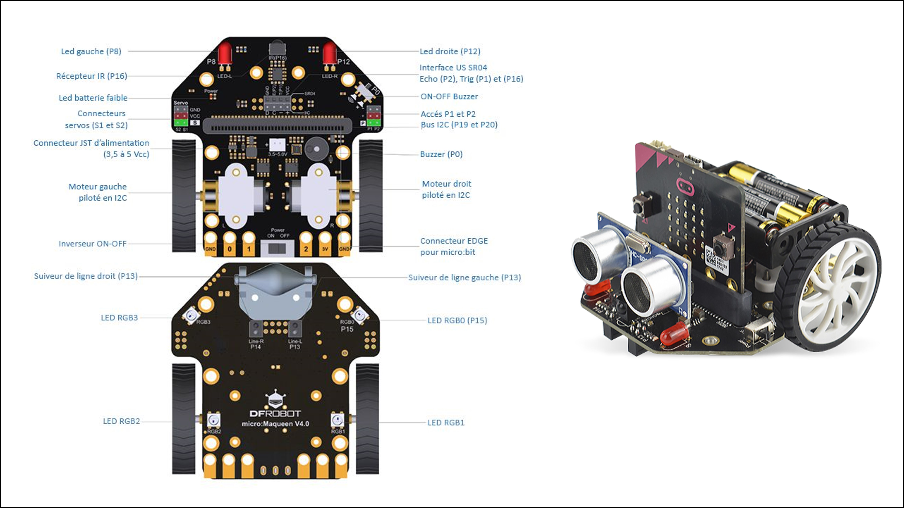

..  _robotique-monde-robots:

Le monde des robots
###################

..  qnum::
    :prefix: q-
    :start: 1

Introduction
============

Les robots sont des appareils mécaniques contrôlés par ordinateur,
capables d’effectuer des tâches automatisées de manière autonome. Cela
fait bien longtemps qu’ils jouent un rôle important dans l’industrie,
dans la technologie, dans la médecine, dans la recherche et dans les
sciences, à savoir dans pratiquement tous les domaines de l’activités
humaines. Alors que les premiers robots étaient conçus pour assister les
humains dans les tâches monotones et pénibles physiquement, les robots
de nouvelle génération sont capables de collecter des données sur leur
environnement à l’aide de capteurs, de prendre des décisions pertinentes
ou d’adapter leur comportement en fonction de leur environnement
(auto-apprentissage). On parle alors de robots auto-apprenants
(*self-learning robot* en anglais).

Il existe différents types de robots : les robots industriels fixes, les
robots mobiles ou les **robots humanoïdes**. Mais il y a une chose que
tous les robots ont en commun : ils doivent tous être programmés. Il
faut des humains pour décrire de manière très précise la tâche qu’un
robot doit effectuer à l’aide d’une suite d’instructions, à savoir d’un
programme informatique.

..  raw:: html

    

    

    Robots industriels sur une chaîne de montage (bras robotisés)

..  raw:: html

    

    

    

    Robot éducatif humanoïde Nao

..  raw:: html

    

    

Les capacités des robots leur viennent donc des programmes informatiques
exécutés par leur « cerveau », appelé microcontrôleur. De plus en plus
d’appareils et de machines deviennent « intelligents » par l’ajout de
microcontrôleurs, de capteurs et de systèmes de télécommunication. Ils
sont capables d’échanger des données en provenance de leurs capteurs et
diverses informations tout en communiquant avec des services qui
s’exécutent dans le nuage. On appelle « Internet des objets » (*Internet
of Things*, en anglais) cette révolution technologique qui constitue un
volet important de la numérisation de la société.

Dans ces chapitres de robotique vous allez acquérir une compréhension
fondamentale de la programmation des robots, de l’utilisation de capteurs pour
les contrôler et de la programmation de robots capables d’apprentissage. Les
exemples de programme présentés dans ces chapitres peuvent être exécutés sur un
robot Maqueen piloté par une carte micro:bit ou même en mode simulation, dans
l’environnement de développement TigerJython, sans avoir avoir recours à un
robot physique.

    Robot Maqueen basé sur la carte de développement micro:bit

Pour développer nos programmes, nous continuons dans ces chapitres
d’utiliser le langage Python et l’environnement de développement
TigerJython.

   

Quels sont les éléments technologiques qui se cachent derrière les robots ?
===========================================================================

La robotique moderne est le résultat d’un long processus de
développement. Au début, la majorité des robots étaient fixes servaient
à automatiser les tâches dans l’industrie alors que de nos jours, ce
sont les capteurs et leur mise en réseau qui joue un rôle déterminant.

Le composant le plus important d’un robot est le **microcontrôleur**. 
Ce dernier est responsable de l’exécution des programmes, de
l’interrogation et de l’évaluation des valeurs reçues des capteurs, et
du pilotage des composants actifs (par exemple, les moteurs et les
LEDs). Certains robots possèdent plusieurs microprocesseurs qui
communiquent entre eux. possède plusieurs microprocesseur(
coprocesseur).

    Schéma de fonctionnement d’un robot

La plupart des robots sont équipés de **capteurs** (*sensor* en anglais, qui
vient du latin *sensus* = sens) qui collectent des données sur leur
environnement, à l’image de nos cinq sens humains. Les capteurs sont des
appareils de mesure qui transforment en signaux électriques des grandeurs
physiques telles que l’intensité lumineuse, la distance, la température,
l’humidité de l’air et les transmettent au microcontrôleur.

Les **actuateurs** (*actuators* en anglais) sont les composants actifs d’un
robot (moteurs, LEDs, haut-parleur, buzzer, vibreur, …). Ils exécutent les
commandes qu’ils reçoivent du microcontrôleur sous forme de signaux électriques
en les transformant en mouvements mécaniques ou en ondes lumineuses ou sonores.
De simples robots suffisent à montrer comment les robots sont construits et
comment ils fonctionnent. Dans ce cours, nous aurons recours au robot Maqueen,
nommé *mbRobot* dans TigerJython (robot basé sur la carte micro:bit).

On peut apercevoir la petite puce qui fait office de microcontrôleur sur la
carte micro:bit qui permet de le piloter. De nos jours, des puces similaires
sont présentes dans tous les appareils électroniques courants tels que les
smartphones, les machines à laver, les télévisions etc. Les deux modèles de
robots possèdent des moteurs, des LEDs et plusieurs capteurs. Il est possible de
les programmer simplement à l’aide de modules Python spéciaux mis à disposition
dans l’environnement TigerJython.

..  raw:: html

    

    

    Le robot *mbRobot* (Maqueen contrôlé par une carte micro:bit)

..  raw:: html

    

    

    La carte micro:bit qui fait office de cerveau pour le robot Maqueen

..  raw:: html

    

    

Caractéristiques techniques du robot Maqueen
============================================

..  youtube:: vMVg9QMOxvk
    :width: 800
    :height: 430

Voici les différents composants présents sur le robot Maqueen et qui sont
contrôlables par des programmes qui s'exécutent sur le micro:bit:

    Composants et caractéristiques techniques du robot Maqueen basé sur
    Micro:bit.

Les robots utilisé au CSUD ont été légèrement modifiés pour intégrer un accu
rechargeable Lithium-Polymer (LiPo) de 1500mAh. Il faut bien faire attention à
distinguer deux ports micro-USB différents. L'un sert uniquement à charger
l'accu. On peut pour cela le brancher à un port USB alimenté d'un ordinateur ou
à un chargeur de smartphone standard avec un câble micro-USB. L'autre port sert
uniquement à **programmer** le robot. 

    Deux ports USB différents sur les robots Maqueen du CSUD.

Quelle est la différence entre un robot et un ordinateur de bureau ?
====================================================================

Un robot, tout comme un ordinateur, contient un microprocesseur (aussi appelé
microcontrôleur). Ce mini-ordinateur est donc embarqué dans un appareil
technique, raison pour laquelle on parle de **système embarqué** (*embedded
system* en anglais). Au contraire des ordinateurs de bureau, les robots
possèdent des capteurs, des actuateurs et des d’autres composants mécaniques.
Les microprocesseurs des robots sont en général beaucoup moins puissants que
ceux présents dans les ordinateurs de bureau. Les chiffres du tableau comparatif
ci-dessous parlent d'eux-mêmes:

..  list-table:: Comparaison technique entre un ordinateur et un microcontrôleur
    :widths: 80 40 40
    :align: left
    :header-rows: 1

    * - Composant
      - Ordinateur
      - Microcontrôleur (micro:bit)
  
    * - CPU (Central Processing Unit)
    
        ..  admonition:: Rôle
            :class: tip

            Le CPU est responsable d'exécuter les programmes. Plus il est
            rapide, plus les programmes s'exécutent rapidement et sont
            réactifs.

      - + Consommation : plusieurs dizaines de Watts
        + Fréquence d'horloge : 1000 - 4000 MHz
        
      - + Consommation : moins d'un Watt
        + Fréquence d'horloge : 16 MHz (v1) ou 64 MHz (v2)
            
    * - RAM (Mémoire vive)
    
        ..  admonition:: Rôle
            :class: tip

            La mémoire vive est la mémoire à court terme qui permet de stocker
            les données à traiter par le CPU, ainsi que les instructions du
            programme exécuté par le CPU et le système d'exploitation.

            Toutes les données présentes dans la mémoire vive sont perdues
            lorsque le système est éteint (mémoire volatile).

      - + Capacité : 16 Go = 16'000 Mo = 16'000'000 Ko
        
      - + Capacité : 16 Ko = 1'000'000 de fois moins de mémoire qu'un PC

    * - Stockage de masse
    
        ..  admonition:: Rôle
            :class: tip

            Le stockage de masse est la "mémoire à long terme", qui permet de
            stocker des données lorsque le système est éteint.

      - + Capacité (SSD) : 1 To = :math:`10^3` Go = :math:`10^6` Mo = :math:`10^9` ko
        
      - + Capacité (Flash) : 256 Ko = environ 4 millions de fois moins qu'un PC 

    * - Système d'exploitation
    
        ..  admonition:: Rôle
            :class: tip

            Contrôler le système, gérer les ressources, gérer l'exécution des
            programmes, gérer la communication avec le matériel.

      - Windows, Mac OS, Linux, etc ... Ces systèmes sont extrêmement complexes
        et gourmands en ressources. Ils nécessitent généralement plusieurs Go de
        mémoire vive sur un PC / Mac.
        
      - Sur les microcontrôleurs, le système d'exploitation est extrêmement
        basique et s'appelle un **firmware** (on utilise parfois le terme
        francophone **micrologiciel**). Il peut tenir dans quelques Ko de RAM.

Bien qu'ils soient beaucoup moins puissants que les processeurs des ordinateurs
personnels, les microcontrôleurs sont spécialisés pour contrôler et réguler les
comportements des robots et des **systèmes embarqués** (*embedded systems* en
anglais). On développe en général les programmes informatiques à destination des
robots sur des ordinateurs externes, que l’on télécharge ensuite sur le robot.
Ce dernier se comporte ensuite comme un système intelligent autonome capable de
prendre des décisions en fonction des données reçues des capteurs.

Particularités de la programmation des robots
=============================================

..  youtube:: GdJE4SKD1hw
    :width: 800
    :height: 430

Jusqu’à présent, vous avez écrit des programmes pour l’ordinateur en
utilisant TigerJython. Il s’agissait d’une série de commandes, chacune
d’entre elles étant exécutée dans son intégralité. Cependant, la
programmation des robots exige une autre façon de penser. En robotique,
on ne pense pas en termes d’actions entièrement exécutées, mais en
termes d’états. Le robot est mis dans un état et effectue les activités
qui correspondent à cet état. Il reste dans cet état jusqu’à ce qu’il
cange d’état. La chose importante est que le robot puisse agir de
manière autonome et effectuer lui-même un changement d’état en fonction
de la situation. Les décisions qu’il doit prendre à cet effet sont mises
en œuvre dans le programme. La nouveauté, c’est qu’il faut tenir compte
de la réalité physique lors de la programmation. On ne peut pas dire au
robot : “Avance d’un mètre”. Il faut d’abord expérimenter pour
déterminer le temps dont le robot a besoin pour avancer d’exactement un
mètre avec une vitesse de rotation donnée du moteur. Il faut donc
déterminer combien de temps le robot doit rester en état de mouvement
pour avancer de 1 mètre. Ce temps peut également dépendre de la friction
avec la surface et même du moteur. En robotique, il est donc central
d’expérimenter en testant ses programmes.

De tels changements d’état interviennent également dans la vie de tous
les jours :

Exemple
-------

Considérons un système de contrôle des feux de circulation à un passage
piéton équipé de capteurs. Le feu de signalisation pour piétons peut
prendre trois états : “rouge”, “jaune” et “vert”. Si le système de
contrôle détecte un piéton qui veut traverser la route, en traversant la
route, le feu passe au “vert” et reste dans cet état pour pendant 40
secondes, après quoi il passe à l’état “jaune”. Après 8 secondes, il
passe au “rouge” et reste dans cet état jusqu’à ce que le prochain
piéton soit détecté. Nous pouvons représenter graphiquement ce processus
à l’aide d’un diagramme d’état. Les états sont représentés par des
cercles et les transitions entre les états par des flèches. Voici un
exemple de diagramme d’état :

    Diagramme d’états contrôlant le comportement du feu de passage piétons

C’est ainsi que l’on programme les robots. C’est le programme qui
détermine les états et les transitions d’état. Une fois le programme
lancé, le robot agit généralement de manière autonome dans le sens où il
suit les instructions du programme enregistré en interne et n’est pas
contrôlé par des instructions externes. Souvent, les transitions d’état
sont déterminées par les données de mesure des capteurs.

Prendre le robot en mains
=========================

L’environnement de développement TigerJython contient des modules et des
outils qui permettent de programmer des robots en toute simplicité. Bien
que les deux modèles de robots LEGO® EV3 et mbRobot soient différents à
première vue, ils se programment pratiquement de la même manière. Avant
de commencer à programmer, quelques travaux préparatoires sont
nécessaires.

Dans ce cours, nous programmerons exlusivement le robot Maqueen contrôlé
par le micro:bit (mbRobot).

Instructions de mise en route du robot Maqueen (mbRobot)
--------------------------------------------------------

..  attention::

    La manipulation suivante doit être faite si vous possédez un robot Maqueen à
    la maison, mais **en aucun cas sur les robots du Collège du Sud** qui sont
    déjà configurés pour bien fonctionner.

    Le kit Maqueen (DF Robot) contient un circuit imprimé dans lequel sont déjà
    installés des moteurs, des capteurs infrarouges et ultrasoniques, des LED et
    une bande de connexion pour le micro:bit. Avant de l’utiliser pour la
    première fois, vous devez installer un micrologiciel (firmware) sur le
    micro:bit. Connectez le micro:bit à l’ordinateur via un câble USB,
    sélectionnez “Tools>Devices>microbit/Calliope” dans TigerJython et ensuite
    “Tools>Flash Target”.

    Il faut connecter la carte micro:bit du mbRobot à un port USB libre de votre
    ordinateur pour pouvoir le programmer.

    Configurer TigerJython pour programmer le robot Maqueen en Python 3.

Éditer et exécuter un programme
===============================

Exemple 2
---------

Cet exemple montre comment allumer et éteindre les LEDs intégrées au
robot.

..  youtube:: fo4XHz5b__c
    :width: 800
    :height: 430

..  raw:: html

    

    

..  code-block:: python
    :linenos:
 
    from mbrobot import *

    setLED(1)
    delay(3000)
    setLED(0)

..  raw:: html

    

    

   

..  raw:: html

    

    

   
Vous pouvez constater que pour contrôler le robot mbRobot, il faut
importer le module ``mbobot``. C’est ce module qui définit toutes les
commandes que vous pouvez utiliser pour programmer le robot.

Pour exécuter ce programme, copiez-le dans TigerJython et cliquez sur le bouton
|real_mode_btn| de la barre d’outils de TigerJython, ce qui va télécharger votre
code Python sur le micro:bit qui contrôle le mbRobot et lancer son exécution
directement sur le robot. Une fois que le programe a été téléchargé sur le
robot, le câble USB n’est plus nécessaire et le robot peut exécuter le programme
de manière autonome. Lorsque le programme est lancé depuis TigerJython, une
fenêtre de terminal s’ouvre sur l’ordinateur et permet de voir les éventuelles
erreurs d’exécution que rencontrent le programme ou de voir sa sortie standard
(ce qui est affiché par les commandes ``print()``).

La commande ``setLED(1)`` allume les LEDs rouges. Autrement dit, les
LEDs passent de l’état “ON” à “OFF”. La commande ``delay(ms)`` permet de
mettre le microprocesseur en pause (mettre l’exécution du programme en
pause) avant d’exécuter la prochaine commande ``setLED(0)`` qui repasse
les LEDs dans l’état “OFF”. On peut visualiser l’exécution de ce
programme par le diagramme de séquence (à droite) :

..  raw:: html

    

    

    Diagramme d’états

..  raw:: html

    

    

    Diagramme de séquence

..  raw:: html

    

    

   

On peut aussi se représenter l’exécution du programme grâce au diagramme
d’états (ci-dessus à gauche). Dans notre exemple, on a les états “ON” et
“OFF” et les commandes ``setLED(1)`` et ``setLED(0)`` qui permettent les
transitions d’états.

Même si le robot est débranché de l’ordinateur, votre programme est
conservé sur le robot et peut être relancé en redémarrant simplement le
robot (éteindre / allumer) ou en appuyant sur le bouton “reset” du
micro:bit, **à côté de la prise USB du micro:bit** (et non celle qui
permet de recharger la batterie du robot).

Activité 1
----------

..  shortanswer:: intro-robotique-activite-01

    Que se passe-t-il si on supprime l’instruction ``delay(3000)`` du
    programme de l’exemple précédent.

Activité 2
----------

..  activecode:: intro-robotique-activite-02

    Complétez le programme de l’exemple 2 de telle manière que les LEDs
    cligotent trois fois de suite à une seconde d’intervalle.

    N’oubliez pas d’importer le module ``mbrobot``.

    ~~~~

..  admonition:: Remarque
    :class: info

    Il est possible d’exécuter la plupart des programmes en mode simulation.
    Cela permet de simuler l’exécution du programme sur l’ordinateur, dans
    TigerJython, avant de le télécharger sur le robot. Cela permet en
    général de gagner du temps et de vérifier que le programme ne contient
    aucune erreur de syntaxe ou de logique facile à détecter.

    Pour cela, il faut cliquer sur le bouton “play”, comme pour exécuter un
    programme de manière habituelle sur TigerJython.

    ..  figure:: 01-intro-robotique/figure-14.png
        :alt: 01-intro-robotique/figure-14.png

        Lancer le programme en mode simulation (bouton play) ou en mode réel.

Exemple 3
---------

La commande ``motL.rotate(50)`` permet de mettre en marche le moteur gauche avec
la vitesse 50. La vitesse est un nombre entier compris entre -255 et 255. Avec
des valeurs positives, le moteur contribue à faire avancer le robot (sens
contraire des aiguilles d’une montre), avec des valeurs négatives, il contribue
à faire reculer le robot (sens des aiguilles d’une montre). Si la vitesse est 0,
le moteur est arrêté. De même, le moteur droit peut être mis en marche avec
``motR.rotate(50)``.

..  admonition:: Module ``mbrobotmot``
    
    Pour utiliser ``motL`` et ``motR``, il faut importer le module
    ``mbrobotmot`` au lieu du module ``mbrobot`` avec l'instruction

    ::

        from mbrobotmot import *

Testez le moteur gauche avec le programme ci-dessous:

..  code-block:: python
    :linenos:
    :emphasize-lines: 2,4,6,8

    from mbrobotmot import *

    motL.rotate(50)
    delay(2000)
    motL.rotate(-30)
    delay(3000)
    motL.rotate(0)

..  attention::

    Il ne faut pas oublier d’alimenter les moteurs du robot avec
    l’interrupteur d’alimentation à l’arrière du robot.

Interrompre un programme
~~~~~~~~~~~~~~~~~~~~~~~~

Pour interrompre un programme, il faut éteindre le robot en positionnant
l’interrupteur à l’arrière du robot sur OFF.

Rotation des roues en module simulation
~~~~~~~~~~~~~~~~~~~~~~~~~~~~~~~~~~~~~~~

En mode simulé, l’environnement TigerJython montre la rotation des roues
du robot, ainsi que l’angle de rotation effectué jusqu’à présent.

    01-intro-robotique/figure-15.png

Activité 3
----------

..  activecode:: intro-robotique-activite-03-a

    Complétez le programme ci-dessous pour faire tourner les deux moteurs
    simultanément à la même vitesse pendant 3000 ms. Pour le moteur droit,
    utilisez la commande ``motR.rotate(50)``.

    ~~~~
    from mbrobotmot import *

    motL.rotate(50)

..  shortanswer:: intro-robotique-activite-03-b

    Que se passe-t-il si vous faites tourner un moteur plus vite que l’autre?

Activité 4
----------

..  activecode:: intro-robotique-activite-04

    Ecrivez un programme pour que le robot tourne sur lui-même vers la
    gauche pendant 4000 ms.

    ~~~~
    from mbrobot import *

Activité 5
----------

..  activecode:: intro-robotique-activite-05

    Écrivez un programme qui déplace le robot sur un arc de cercle. Pour ce
    faire, expérimentez avec les vitesses pour chacun des moteurs. Dessinez
    ensuite un cercle de rayon 50 cm sur le sol. Adaptez votre programme jusqu’à
    ce que le robot se déplacer le plus précisément possible le long du cercle
    dessiné.

    ~~~~
    from mbrobot import *

Résumé
======

-  Programmer un robot signifie penser en termes d’états. Chaque état
   correspond à une activité du robot, qui exécute cette activité
   jusqu’à ce qu’il passe à un autre état.
-  La commande ``delay(ms)`` spécifie la durée pendant laquelle les
   actuateurs du robot (LED, moteurs) restent un même état avant de
   passer à un nouvel état par l’effet d’une nouvelle commande.
-  Si un robot est en train d’avancer et reçoit la commande
   ``setLED(1)``, il ne s’arrête pas. Le robot continue d’avancer et
   allume en plus les LEDs. Si le robot s’arrête ensuite avec
   ``motL.rotate(0)`` et ``motR.rotate(0)``, les LEDs restent allumées.
   Les commandes ne modifient que les paramètres (activités ou
   propriétés) de l’état pour lequel elles sont prévues.
-  Les programmes peuvent être visualisés à l’aide d’un diagramme de
   séquences ou d’un diagramme d’état.
-  Pour tester les programmes, il vaut souvent le peine de commencer par
   utiliser le module simulation.
-  Si vous voulez que le robot avance, vous devez faire en sorte que les
   deux moteurs tournent à la même vitesse. Si la vitesse est
   différente, il se déplacera sur une trajectoire circulaire.

Commandes abordées dans ce chapitre
-----------------------------------

..  list-table:: Liste des commandes abordées dans ce chapitre
    :widths: 30 35
    :align: left
    :header-rows: 1

    *   - Syntaxe
        - Signification

    *   - ``setLED(1)``
        - allume les LEDs. 

    *   - ``setLED(0)``
        - éteint les LEDs

    *   - ``motL.rotate(speed)``
        - Fait tourner le moteur gauche à la vitesse
          indiquée par ``speed``. Le moteur tourne dans le sens des aiguilles de
          la montre si :math:`\text{speed} > 0`, et dans le sens inverse si
          :math:`\text{speed} < 0`. Le moteur est arrêté si :math:`\text{speed}
          = 0`.

          ..  attention::

              Nécessite l'importation du module ``mbrobotmot``.

    *   - ``motR.rotate(speed)``
        - Fait tourner le moteur droite à la vitesse
          indiquée par ``speed``. Le moteur tourne dans le sens des aiguilles de
          la montre si :math:`\text{speed} > 0`, et dans le sens inverse si
          :math:`\text{speed} < 0`. Le moteur est arrêté si :math:`\text{speed}
          = 0`.

          ..  attention::

              Nécessite l'importation du module ``mbrobotmot``.

    *   - ``delay(ms)``
        - Met l’exécution du programme en pause et attend
          ``ms`` millisecondes avant de poursuivre son exécution avec la
          prochaine commande.

Auto-évaluation
===============

Concepts et commandes
---------------------

Question 1
~~~~~~~~~~

..  shortanswer:: intro-robotique-resume-comprehension-01

    Que se passe-t-il si vous actionnez le moteur gauche avec une vitesse de
    60 et le moteur droit avec une vitesse de 20 pendant un certains laps de
    temps?

Question 2
~~~~~~~~~~

..  shortanswer:: intro-robotique-resume-comprehension-02

    Quelle est la différence entre les deux programmes ci-dessous au niveau du
    comportement du robot:

    ..  raw:: html

        

        

    ..  code-block:: python
        :linenos:

        from mbrobot import *

        setLED(1)
        delay(2000)
        setLED(0)
        setLED(1)
        delay(1000)
        setLED(0)
        delay(1000)

    ..  raw:: html

        

        

    ..  code-block:: python
        :linenos:

        from mbrobot import *

        setLED(1)
        delay(2000)
        setLED(0)
        delay(1000)
        setLED(1)
        delay(1000)
        setLED(0)

    ..  raw:: html

        

        

..  _comprehension-3-1:

Question 3
~~~~~~~~~~

..  shortanswer:: intro-robotique-resume-comprehension-03

    Que se passe-t-il lors de l’exécution du programme ci-dessous? Répondez sans
    exécuter le programme sur le robot.

    ..  code-block:: python
        :linenos:

        from mbrobotmot import *

        motL.rotate(50)
        motR.rotate(50)
        delay(2000)
        motL.rotate(0)
        delay(1180)
        motL.rotate(50)
        delay(2000)
        motL.rotate(0)
        motR.rotate(0)

Exercices
---------

..  _exercice-1-1:

Exercice 1
~~~~~~~~~~

Programmez le robot pour qu’il se déplace d’abord en ligne droite,
tourner ensuite de 90 degrés vers la droite et continue ensuite tout
droit. Il y a trois manières d’effectuer la rotation

1. le robot tourne sur lui-même (axe central)
2. le robot tourne sur l’axe situé sur la roue droite
3. le robot tourne sur un arc de cercle

Effectuez le mouvement demandé avec les trois types de rotations (trois
programmes différents).

..  activecode:: intro-robotique-exercice-01-a

    Programmez le mouvement consistant à faire tourner le robot sur lui-même
    (axe central).

    ~~~~
    from mbrobot import *

..  activecode:: intro-robotique-exercice-01-b

    Programmez le mouvement consistant à faire tourner le robot sur l'axe situé
    sur la roue droite.

    ~~~~
    from mbrobot import *

..  activecode:: intro-robotique-exercice-01-c

    Programmez le mouvement consistant à faire tourner le robot sur un arc de
    cercle

    ~~~~
    from mbrobot import *

Exercice 2
~~~~~~~~~~

..  activecode:: intro-robotique-exercice-02

    Définissez une commande ``avance(speed)`` qui permet de faire avancer le
    robot tout droit à une vitesse de ``speed``. Définissez une autre commande
    ``stop()`` qui arrête le robot. Utilisez les commandes définies pour faire
    avancer le robot pendant 3 secondes.

    ~~~~
    from mbrobot import *

Exercice 3
~~~~~~~~~~

..  activecode:: intro-robotique-exercice-03

    Définissez une nouvelle commande ``recule(speed)`` qui fait reculer le
    robot à une vitesse de ``speed`` en allumant les LEDs. Utilisez ensuite
    les nouvelles commandes ``avance()``, ``recule()`` et ``stop()`` pour
    faire avancer le robot pendant 2 secondes, le faire reculer pendant 3
    secondes et ensuite l’arrêter. Après l’exécution de la commande
    ``stop()``, les LEDs doivent à nouveau s’éteindre.

    ~~~~
    from mbrobot import *

Exercice 4
~~~~~~~~~~

..  shortanswer:: intro-robotique-exercice-04

    Exécuter le programme suivant sur le robot. Décrivez ensuite le trajet
    emprunté par le robot.

    ..  code-block:: python
        :linenos:

        from mbrobotmot import *

        motL.rotate(20)
        motR.rotate(40)
        delay(2000)
        motL.rotate(0)
        delay(2000)
        motR.rotate(0)

Exercice 5
~~~~~~~~~~

..  activecode:: intro-robotique-exercice-05

    Définissez une nouvelle commande ``arc(left_speed, right_speed)`` qui
    permet d’actionner le moteur gauche avec la vitesse ``left_speed`` et le
    moteur droit avec la vitesse ``right_speed``. Testez votre programme
    avec différentes valeurs de ``left_speed`` et ``right_speed``.

    ~~~~
    from mbrobot import *

Exercice 6
~~~~~~~~~~

..  shortanswer:: intro-robotique-exercice-06

    Nous avons vu que les robots peuvent prendre des formes très différentes
    et avons évoqué les robots industriels, les robots mobiles et les robots
    humanoïdes. Faites une petite recherche sur le Web et citez encore trois
    autres formes de robots très différents qui existent.

    Pensez aux différents domaines d’activités humaines : recherche
    scientifique, domaine médical, livraison et logistique, défense,
    exploration spatiale ou marine, …

    Faites ensuite une mise en commun en classe des différents types de
    robots recensés.

..  reveal:: 5E891DD8-D5DF-44E9-9D35-D9DBCE3AA0A1
    :showtitle: Réponse

    ..  admonition:: Les robots logistiques
        :class: info

        ..  youtube:: TUx-ljgB-5Q
            :width: 800
            :height: 430

        Le revers de la médaille : les conditions de travail sont vraiment
        difficiles pour les employés de tels centres logistiques automatisés.
        
        ..  youtube:: 8Zybd7mLgjM
            :width: 800
            :height: 430

    ..  admonition:: Les robots médicaux
        :class: info

        ..  youtube:: _dWkpfuSf44
            :width: 800
            :height: 430

        ..  youtube:: DfV8xu2nHy4
            :width: 800
            :height: 430

    ..  admonition:: Les robots bio-inspirés

        ..  youtube:: XZKAGEV7bw0
            :width: 800
            :height: 430

    ..  admonition:: Exploration spatiale

        ..  youtube:: cqzo5R504as
            :width: 800
            :height: 430

