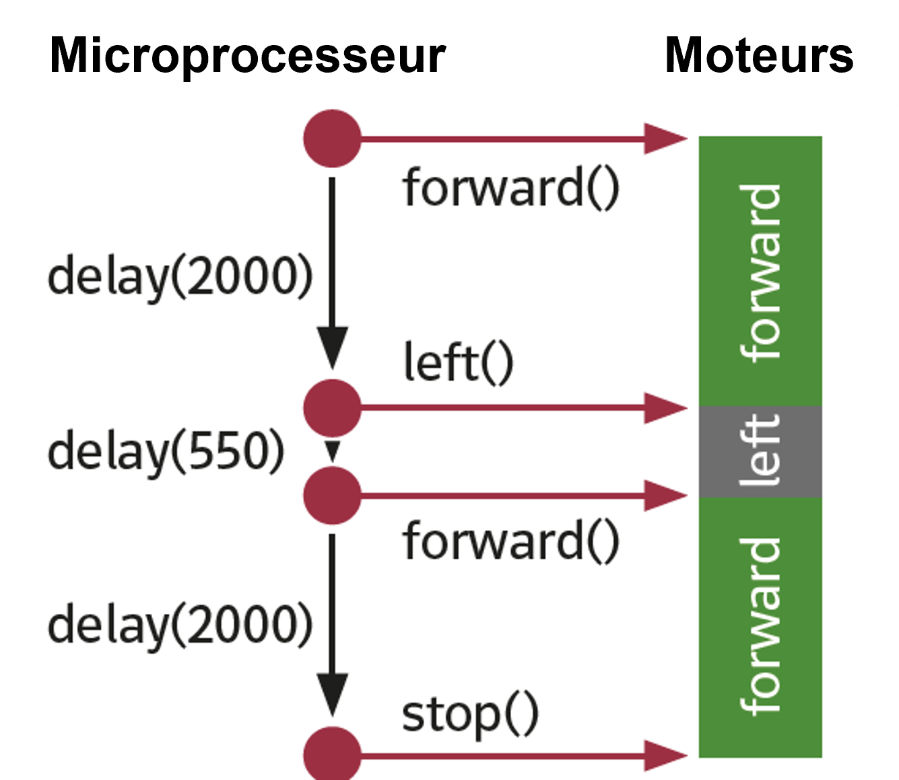
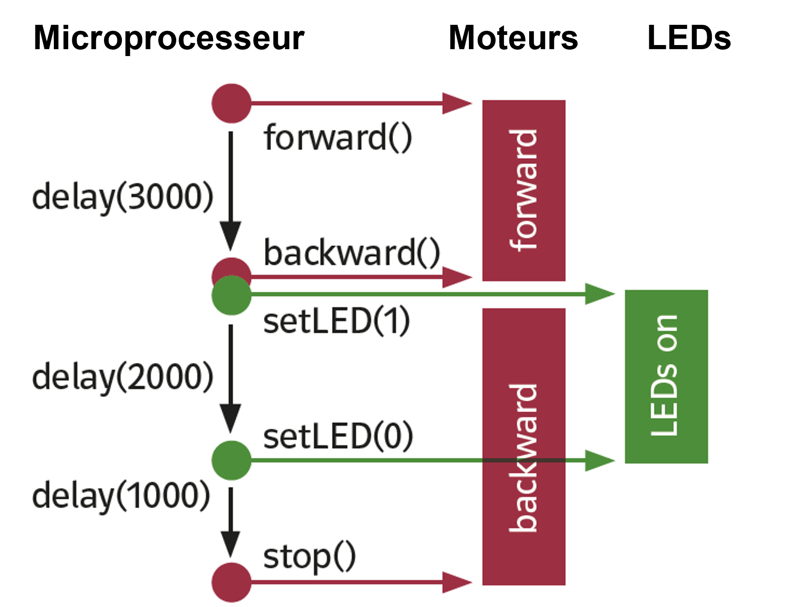
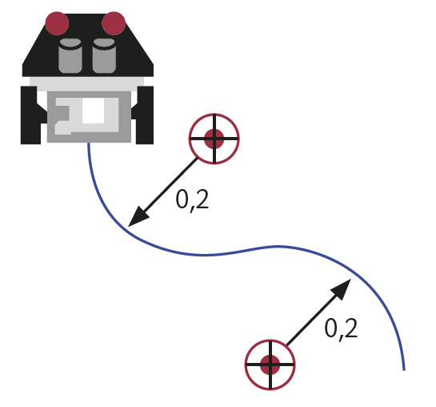
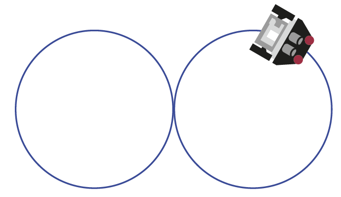

Mettre le robot en mouvement
############################

..  qnum::
    :prefix: q-
    :start: 1

Une fonctionnalité importante des robots mobile est leur capacité de se
déplacer de manière autonome dans leur environnement. Il peut s’agir de
mouvements qui consistent à déplacer le robot dans son environnement à
l’aide de roues ou de chenilles, ou à déplacer des parties mobiles du
robot, tel qu’un bras robotisé. Ces mouvements sont engendrés par des
moteurs. Le contrôle des moteurs, à savoir leur vitesse et leur sens de
rotation, est déterminé par les programmes qui s’exécutent sur le robot.

Objectifs du chapitre
=====================

-  Appliquer les concepts les concepts fondamentaux de la
   programmation telles que les boucles, les instructions
   conditionnelles et la programmation modulaire pour programmer des
   robots.
-  Programmer des mouvements complexes à l’aide de la programmation
   modulaire
-  Expérimenter avec la vitesse de rotation des moteurs et la durée
   des mouvements pour que le robot se comporte de manière appropriée

Contrôler le robot
==================

Dans le précédent chapitre, vous avez appris à piloter un seul moteur du
robot de manière indépendante. Et afin de simplifier la programmation
des mouvements du robot, le module de robotique ``mbrobot`` met à
disposition des commandes qui permet de contrôler le robot mobile dans
son ensemble, constitué de deux moteurs. Il s’agit des commandes
``forward()``, ``backward()``, ``left()``, ``right()``,
``leftArc(radius)``, ``rightArc(radius)`` et ``stop()``.

Vidéo d'introduction
--------------------

..  admonition:: Concepts de programmation révisés

    La présentation vidéo ci-dessous montre un exemple de comportement
    relativement complexe qu'il est nécessaire de décomposer en commandes et
    sous-commandes pour que le programme reste bien compréhensible et gérable.
    La vidéo permet de réviser les notions de programmation suivantes vues
    l'année passée:

    *  Commandes sans et avec paramètres
    *  Programmation modulaire
    *  Boucles bornées (répétition d'une action un nombre de fois connu à l'avance) avec la boucle ``for``

..  admonition:: Conseil
    :class: tip

    Il est conseillé d'augmenter la résolution de la vidéo à 720p au minimum et
    d'accélérer la lecture pour gagner du temps (1.5 fois au moins).

..  youtube:: 7NVnKWHoAgc
    :width: 800
    :height: 430

Exemple 1
---------

..  admonition:: Remarque
    :class: tip

    Si vous avez bien compris le chapitre précédent, vous pouvez ignorer cet
    exemple qui n'apporte rien de plus que le chapitre
    :ref:`robotique-monde-robots`.

Le programme ci-dessous fait en sorte que le robot avance pendant 2000
ms, tourne ensuite de 90° vers la gauche, avance à nouveau tout droit
pendant 2000 ms et finit par s’arrêter.

..  raw:: html

    

    

..  code-block:: Python
    :linenos:

    from mbrobot import *

    forward()
    delay(2000)
    left()
    delay(550)
    forward()
    delay(2000)
    stop()

..  raw:: html

    

    

    Diagramme de séquence correspondant

..  raw:: html

    

    

    
La commande ``forward()`` met le robot dans l’état avancer en ligne
droite. La durée du mouvement est déterminée par la commande
``delay(2000)``.Le microprocesseur n’exécute la prochaine commande
qu’après 2000 ms et, en attendant, le robot reste dans l’état «
avancer». La commande left () fait en sorte que le robot tourne sur
lui-même vers la gauche. Après 550 ms, il s’est tourné d’environ 90°.
Ensuite, ils avancent à nouveau tout droit pendant 2000 ms.

Différence entre le robot et la tortue
--------------------------------------

..  admonition:: Remarque
    :class: tip

    Si vous avez bien compris le chapitre précédent, vous pouvez ignorer cet
    exemple qui n'apporte rien de plus que le chapitre
    :ref:`robotique-monde-robots`.

En première année, vous avez beaucoup utilisé la tortue graphique pour apprendre
la programmation. Les commandes ``forward(100)`` ou ``left(50)`` permettait de
contrôler la tortue de manière exacte dans la fenêtre graphique. Le robot, au
contraire de la tortue, est un objet physique dont la précision dépend de
multiples facteurs, parmi lesquels l’environnement, sa qualité de construction,
la qualité de ses composants (moteurs, capteurs). De plus, alors qu’après la
commande ``forward(100)`` la tortue s’arrête en attendant l’exécution d’une
prochaine commande, le robot ne s’arrête pas après l’exécution de la commande
``forward()``, mais continue de se déplacer jusqu’à ce qu’une autre commande le
fasse passer dans un autre état. La durée pendant laquelle le robot reste dans
un même état et déterminée par un appel à la commande ``delay(ms)``, où ``ms``
désigne le temps à attendre avant de changer d’état. Il n’est donc pas possible
d’indiquer la distance sur laquelle le robot doit se déplacer, mais uniquement
la durée du déplacement, par tâtonnements.

..  code-block:: Python
    :linenos:

    from gturtle import *

    makeTurtle()
    forward(100)
    left(90)
    forward(100)

Activité 1
----------

..  admonition:: Remarque
    :class: tip

    Cet exercice sert de renforcement, il est facultatif, car il n'apporte pas
    fondamentalement de nouveauté. Si vous avez bien compris le chapitre
    :ref:`robotique-monde-robots`, vous pouvez ignorer cet exercice.

..  activecode:: robot-mobile-activite-01

    Construisez un parcours pour votre robot à l’aide d’obstacles ou de bande
    adhésive noir et écrivez un programme qui conduisent le robot à travers le
    parcours de la manière la plus précise possible.

    ..  figure:: 02-robot-mobile/02-robot-mobile-parcours-1.png
        :alt: 02-robot-mobile/02-robot-mobile-parcours-1.png
        :width: 50%

        Trajet que le robot doit parcourir

    ~~~~
    from mbrobot import *

Exemple 2
---------

..  admonition:: Remarque

    Cet exemple est important. Il montre comment faire faire au robot plusieurs
    choses à la fois.

En règle générale, le robot possède plusieurs actuateurs et capteur
qu’il est capable de contrôler et d’interroger de manière simultanée. Il
peut par exemple prendre des mesures de son environnement à l’aide de
ses capteurs tout en avançant. Avec le programme ci-dessous, le robot
fait clignoter ses LEDs tout en reculant.

..  raw:: html

    

    

..  code-block:: Python
    :linenos:

    from mbrobot import *

    forward()
    delay(3000)
    backward()
    setLED(1)
    delay(2000)
    setLED(0)
    delay(1000)
    stop()

..  raw:: html

    

    

    Diagramme de séquence

..  raw:: html

    

    

Activité 2
----------

..  activecode:: robot-mobile-activite-02

    La commande ``setAlarm(1)`` permet d’enclencher un beep sonore et la
    commande ``setAlarm(0)`` de l’éteindre. Compléter le programme
    ci-dessous afin que le robot avance pendant trois secondes tout en
    allumant et en éteignant deux fois les LEDs, Et qu’il recule ensuite
    lentement pendant trois secondes, tout en allumant et en éteignant
    l’alarme. Pour que l’alarme fonctionne, il faut encore importer le
    module ``mbalarm``.

    ~~~~
    from mbrobot import *
    from mbalarm import *

    setAlarm(1)
    delay(3000)
    setAlarm(0)

Exemple 3
---------

Contrairement à la commande ``left()``, qui fait tourner le robot sur
lui-même, la commande ``leftArc(radius)`` provoque un mouvement à la
vitesse standard de 50 sur un arc de cercle de ``radius`` en [m]. Dans
le programme suivant, le robot se déplace d’abord pendant 4 secondes sur
un arc de cercle à gauche, puis à la vitesse 20 pendant 4 secondes sur
un arc de cercle à droite de rayon de 0.2 mètres.

La commande ``setSpeed(speed)`` modifie la vitesse des deux moteurs. Le
paramètre ``speed`` peut prendre des valeurs comprises **entre 0 et 255**.

..  raw:: html

    

    

..  code-block:: Python
    :linenos:

    from mbrobot import *

    leftArc(0.2)
    delay(4000)
    setSpeed(70)
    rightArc(0.2)
    delay(4000)
    stop()

..  raw:: html

    

    

    

    Trajet que le robot doit parcourir

..  raw:: html

    

    

    
..  admonition:: Mode simulation
    :class: info

    En module simulation, il est possible de demander à TigerJython
    d’affiche la trace et le centre de rotation du trajet effectué par le
    robot. Pour ce faire, il faut insérer les lignes suivantes avant
    d’exécuter des commandes du robot :

    ..  code-block:: Python
        :linenos:

        RobotContext.enableTrace(True)
        RobotContext.enableRotCenter(True)

Activité 3
----------

Dans votre cahier, dessinez le diagramme de séquence pour le programme de
l’exemple 3. Vous pouvez également utiliser un logiciel tel que https://draw.io.

..  reveal:: FCDF4A80-5B69-465E-BFF7-C4D39BA12480
    :showtitle: Solution
    :instructoronly:

    ..  figure:: 02-robot-mobile/seq-diagramm-exemple-03.svg
        :width: 40%

        Diagramme d'états pour le programme de l'exemple 3

    ..  admonition:: Logiciel pour dessiner des diagrammes d'états
        :class: info

        Il existe une application en ligne très performante permettant de
        dessiner des diagrammes d'états à l'aide de code source. 

        Lien : https://sequencediagram.org/
        
        Voici le code pour le présent diagramme 

        ::

            # Robot mobile : exemple 3
            participant CPU
            participant Moteurs

            activecolor CPU #red
            activecolor Moteurs #green

            activate CPU
            CPU->Moteurs:leftArc(0.2)
            activate Moteurs
            note over CPU:delay(4000)
            note over Moteurs:leftArc
            CPU->Moteurs:setSpeed(20)
            deactivate Moteurs
            CPU->Moteurs:rightArc(0.2)
            activate Moteurs
            note over CPU:delay(4000)
            note over Moteurs:rightarc
            CPU->Moteurs:stop()
            deactivate Moteurs
            deactivate CPU

Activité 4
----------

..  activecode:: robot-mobile-activite-04

    Disposez des obstacles (par exemple des bouteilles) comme indiqué sur la
    figure ci-dessous et écrivez un programme pour que le robot effectue le
    slalom entre les obstacles le plus rapidement possible.

    ..  figure:: 02-robot-mobile/figure-4.png
        :alt: 02-robot-mobile/figure-4.png
        :width: 40%

        Slalom entre trois obstacles

    ~~~~
    from mbrobot import *

Activité 5
----------

..  activecode:: robot-mobile-activite-05

    Déterminez de manière expérimentale le nombre de millisecondes nécessaires
    au robot pour parcourir un cercle entier de diamètre :math:`0.5\,\text{m}`.
    On résout l'exercice pour une vitesse du robot de 100 (paramètre de
    ``setSpeed()``).

    ..  figure:: 02-robot-mobile/figure-5.png
        :alt: 02-robot-mobile/figure-5.png

    ..  admonition:: Conseil
        :class: tip

        Ne perdez pas trop de temps (maximum 3 minutes) à essayer de tâtonner
        pour faire un cercle parfait. Le but est juste de tâtonner un petit peu.
        Si votre programme fonctionne bien en mode simulé, c'est déjà pas mal.

    ~~~~
    from mbrobot import *
    
    

Question de compréhension 6
---------------------------

..  shortanswer:: robot-mobile-activite-06-comprehension

   La commande ``stop()`` doit-elle nécessairement figurer à la fin du programme
   ou peut-elle également être utilisée ailleurs dans le programme ?

Activité 7
----------

..  activecode:: robot-mobile-activite-07-ac

    Implémentez une commande ``my_left_arc()`` qui produit le même effet que
    l'appel ``leftArc(0.2)`` à l’aide des commandes ``motL.rotate(speed)`` et
    ``motR.rotate(speed)``. Travaillez en mode simulé uniquement.

    ..  admonition:: Indication
        :class: tip

        La commande ``test()`` dans le programme ci-dessous utilise la commande
        ``leftArc(0.2)`` pour dessiner une trace de référence correspondant à un
        arc de cercle de 0.2 mètres de rayon. Travaillez en mode simulé en
        utilisant ``motL.rotate()`` et ``motR.rotate()`` dans la commande
        ``my_left_arc()`` pour que cette dernière fasse suivre au robot la trace
        de référence.

    ~~~~

    # On se permet d'importer les deux modules, car on est en mode simulé et il
    # n'y a pas de restriction de RAM
    from mbrobot import *
    from mbrobotmot import *

    #############################################
    ## Commande de test : ne pas toucher
    #############################################
    def reference_arc():
        # commencer par dessiner la trajectoire à suivre
        RobotContext.enableTrace(True)
        RobotContext.setStartPosition(400, 400)
        setLED(1)

        # dessiner l'arc de cercle de référence et revenir à la position initiale
        setSpeed(100)
        leftArc(0.2)
        delay(1500)
        right()
        delay(550)
        rightArc(0.2)
        delay(1500)
        right()
        delay(550)
        stop()

        # faire une petite pause
        setLED(0)
        delay(1000)

    def main():
        # tracer la trace de référence correspondant à leftArc(0.2)
        reference_arc()

        # exécuter notre propre fonction my_left_arc() pour voir si le robot
        # suit la trace engendrée par leftArc(0.2)
        my_left_arc()
        delay(3000)

        # s'arrêter
        motL.rotate(0)
        motR.rotate(0)

    ##########################################
    ## Compléter la commande ci-dessous
    ##########################################
    def my_left_arc():
        pass

    
    main()

Répéter des commandes (boucles)
===============================

Les robots sont particulièrement utiles pour effectuer des tâches répétitives.
Pour les humains, de telles tâches sont très monotones et les robots sont en
règle générale capables de les effectuer de manière plus efficace. Les robots
sont particulièrement utiles pour effectuer des tâches répétitives. 

Exemple 4
---------

L’exemple ci-dessous montre comment utiliser la boucle ``for`` pour que le robot
se déplace sur un carré. Commencez par exécuter le programme en mode simulation.
En mode réel, il sera probablement nécessaire d’adapter la durée de rotation
pour que l’angle soit approximativement de 90 degrés.

..  code-block:: Python 
    :linenos:

    from mbrobot import *

    for loop in range(4):
        forward()
        delay(2000)
        left()
        delay(550)

    stop()

..  admonition:: Information
    :class: info

    À la différence du mode simuler, dans lequel le robot est capable
    d’effectuer un trajet exact, il n’en va pas de même lorsque le programme est
    exécuté en mode réel. En effet, le robot physique ne parviendra pas à
    avancer exactement en ligne droite ni à effectuer une rotation exacte de 90
    degrés. Cela correspond à la réalité physique. Dans la réalité, même si l’on
    bloque le volant d’une voiture, elle ne pourra pas avancer parfaitement en
    ligne droite, en raison du vent ou des frottements. Pour avancer en ligne
    droite, il faut régulièrement faire de petites corrections au volant
    (régulation du mouvement). C’est pour cette raison que les capteurs sont
    essentiels pour les robots, afin qu’ils puissent corriger ces petites
    imprécisions et corriger leurs mouvements en fonction de la réalité.
    
..  admonition:: Conseil
    :class: tip
    
    Ne perdez donc pas trop de temps à essayer de faire avancer votre robot
    sur un carré parfait. Au prochain chapitre, vous allez apprendre à
    utiliser les capteurs pour corriger la trajectoire du robot.

Activité (boucle ``while``)
---------------------------

..  activecode:: robot-mobile-exemple-04-variante-while

    Remplacez la boucle ``for`` de l'exemple 4 par une boucle ``while`` tout en
    conservant le même comportement du robot

    ~~~~
    from mbrobot import *

Question de réflexion 8
-----------------------

..  shortanswer:: robot-mobile-activite-08-comprehension

    Pourquoi la commande ``stop()`` dans la dernière ligne du programme de
    l’exemple 4 n’est-elle pas indentée? Que se passe-t-il si l’on supprime
    cette commande ``stop()``.

Activité 9.A
------------

..  activecode:: robot-mobile-activite-09-A

    Le robot doit effectuer un trajet en forme de spirale, en partant de
    l’intérieur et en allant vers l’extérieur. Utilisez une boucle et une
    variable ``radius`` qui augmente de plus en plus, ainsi que la
    commande ``leftArc(radius)``.

    ..  figure:: 02-robot-mobile/figure-6.png
        :alt: 02-robot-mobile/figure-6.png
        :width: 40%

        Trajet en spirale que le robot doit effectuer.

    ~~~~
    from mbrobot import *

Activité 9.B
------------

..  activecode:: robot-mobile-activite-09-B

    Le robot doit dessiner une spirale qui commence avec un rayon de 30
    cm, en allant de l’extérieur vers l’intérieur. Après 9 “tours”, le
    robot doit s’arrêter.

    ~~~~
    from mbrobot import *

Exemple 5
---------

Il arrive souvent que le robot doivent effectuer une tâche indéfiniment
ou jusqu’à ce qu’il soit éteint. C’est par exemple le cas s’il doit
collecter des données à l’aide de ses capteurs sur une très longue
durée. Pour ce faire, il faut utiliser une boucle infinie. Dans le cas
présent, le robot doit parcourir un trajet en huit avec une vitesse de
70 et ce, à l’infini.

..  raw:: html

    

    

..  code-block:: Python
    :linenos:

    from mbrobot import *

    setSpeed(70)
    while True:
        leftArc(0.25)
        delay(9635)
        rightArc(0.25)
        delay(9635)

..  raw:: html

    

    

    Trajet que le robot doit effectuer

..  raw:: html

    

    

..  admonition:: Information
    :class: info

    La boucle ``while`` est répétée aussi longtemps que le robot reste
    allumé ou tant que le programme s’exécute. Pour éteindre le robot, il
    faut utiliser l’interrupteur, à l’arrière du robot Maqueen. On peut
    aussi redémarrer le programme à l’aide du bouton *reset* à l’arrière du
    micro:bit, à côté de la prise mini-USB.

Activité 10
-----------

Dessinez le diagramme d’états des moteurs correspondant à l’exemple 5.

..  reveal:: EAF8E1C6-4D90-43BF-9220-4009D87163DE
    :showtitle: Solution
    :instructoronly:

    ..  figure:: 02-robot-mobile/diagramme-etats-exemple-05.png
        :width: 80%

        Diagramme d'états pour le programme de l'exemple 5

Question de réflexion 11
------------------------

..  shortanswer:: robot-mobile-activite-11-comprehension

    Les deux programmes suivants ont-ils le même effet? Répondez d’abord à
    la question avant d’exécuter les programmes.

    ..  raw:: html

        

        

    ..  admonition:: Programme A

        ..  code-block:: Python
            :linenos:

            from mbrobot import *

            for loop in range(3):
                forward()
                delay(1000)
                left()
                delay(550)
            stop()

    ..  raw:: html

        

        

            
    ..  admonition:: Programme B

        ..  code-block:: Python
            :linenos:

            from mbrobot import *

            for loop in range(3):
                forward()
                delay(1000)
            for loop in range(3):
                left()
                delay(550)
            stop()

    ..  raw:: html

        

        

            
Activité 12
-----------

..  activecode:: robot-mobile-activite-12    

    Dans un entrepôt, un robot doit prendre des marchandises présentes en L,
    pour les transporter en A, en B ou en C, en alternance et à l’infini. Le
    robot commence donc par prendre une marchandise en L et la transporte en
    A, il retourne ensuite en L et prend une marchandise qu’il transporte en
    B, revient en L et transporte une marchandise en C. Il recommence
    ensuite ce processus à l’infini.

    ..  figure:: 02-robot-mobile/figure-8.png
        :alt: 02-robot-mobile/figure-8.png
        :width: 40%

        Mouvement à programmer

    Essayez de programme le mouvement le plus précisément possible, mais
    n’oubliez pas que vous n’obtiendrez jamais une précision parfaite. Ne
    passez pas plus de 3 minutes à calibrer le mouvement.

    ~~~~

Structurer ses programmes en définissant ses propres commandes
==============================================================

Il est également avantageux structurer les programmes de manière
modulaire lorsqu’on fait de la robotique.

Exemple 6
---------

..  raw:: html

    

    

..  code-block:: python
    :linenos:
    :emphasize-lines: 3-7, 13-14

    from mbrobot import *

    def blink():
        setLED(1)
        delay(500)
        setLED(0)
        delay(500)

    for loop in range(4):
        forward()
        delay(2000)
        stop()
        blink()
        blink()
        backward()
        delay(2000)
        left()
        delay(550)

..  raw:: html

    

    

Le robot doit avancer sur une certaine distance, faire clignoter deux fois les
LEDs, effectuer le même chemin à reculons, et effectuer une rotation de 90° à
gauche. Il doit répéter ce comportement quatre fois de suite. On isole le code
permettant de faire clignoter les LEDs dans une commande séparée ``blink()``,
pour ne pas avoir à copier-coller ou retaper ce code plusieurs fois.

..  raw:: html

    

    

Question de compréhension 13
----------------------------

..  shortanswer:: robot-mobile-activite-13-comprehension

    Que se passe-t-il si l’on met la commande ``stop()`` après les deux
    ``blink()``?

Activité 14
-----------

..  activecode:: robot-mobile-activite-14

    Programmez le robot pour qu’il se déplace sur une trajectoire en
    escaliers en définissant une commande ``step()`` que vous appelez trois
    fois dans une boucle. Après chaque “marche”, le robot doit faire
    clignoter ses LEDs.

    ~~~~
    from mbrobot import *

Activité 15
-----------

..  activecode:: robot-mobile-activite-15

    Développez un programme pour que le robot parcourt le trajet en escalier
    de l’exercice 14 à l’envers (de haut en bas), et qu’il fasse sonner
    l’alarme à chaque fois qu’il parcourt le trajet vertical de haut en bas.
    Struturez votre programme le mieux possible à l’aide de la programmation
    modulaire.

    ~~~~
    from mbrobot import *
    
Résumé
======

*   Le module mbrobot met à disposition des commandes permettant de
    contrôler le mbRobot efficacement, en commandant les deux moteurs de
    manière synchronisée.

*   Alors que la tortue s’arrête après une commande ``forward(100)``, le
    robot continue d’avancer après que la commande ``forward()`` a fini d’être
    exécutée cette dernière ne fait que de basculer le robot dans l’état
    “avancer à une vitesse de 50”. Il reste dans cet état jusqu’à ce qu’une
    autre commande le fasse passer dans une autre état, par exemple la commande
    ``stop()`` pour le basculer dans l’état “arrêt”.

*   Le robot peut effectuer plusieurs tâches simultanément : il peut par
    exemple avancer tout en faisant clignoter ses LEDs. Chaque commande ne
    modifie qu’un seul paramètre de l’état du robot (LED, alarme, vitesse du
    moteur).

*   Comme avec le tortue, vous pouvez utiliser des boucles pour répéter
    certaines parties du programme et vous pouvez définir vos propres
    commandes pour simplifier les programmes.

*   En robotique, il arrive souvent que l’on utilise volontairement des
    boucles infinies. En effet, dès que le robot est allumé, il est censé
    se comporter de manière autonome jusqu’à ce qu’on l’éteigne.

Nouvelles commandes
-------------------

Dans ce chapitre, vous avez appris les commandes suivantes:

..  list-table:: Liste des commandes abordées dans ce chapitre
    :widths: 30 35
    :align: left
    :header-rows: 1

    *   - Commande / syntaxe
        - Signification

    *   - ``forward()``
        - fait avancer le robot en ligne droite

    *   - ``backward()``
        - fait reculer le robot en ligne droite

    *   - ``left()``
        - fait tourner le robot sur place (sur lui-même) vers la
          gauche

    *   - ``right()``
        - fait tourner le robot sur place (sur lui-même) vers la
          droite

    *   - ``leftArc(radius)``
        - déplace le robot sur un arc de cercle de rayon
          ``radius``, vers la gauche

    *   - ``rightArc(radius)``
        - déplace le robot sur un arc de cercle de rayon
          ``radius``, vers la droite

    *   - ``stop()``
        - arrête le robot

    *   - ``setSpeed(speed)``
        - change la vitesse du robot à ``speed`` (vitesse
          par défaut : 50). Les commanded ``forward()`` et ``backward()`` utilisent
          ensuite cette vitesse.

    *   - ``setAlarm(1)``
        - enclenche l’alarme

    *   - ``setAlarm(0)``
        - éteint l’alarme

    *   - ``RobotContext.enableTrace(True)``
        - Affiche la trace du robot en mode simulation

    *   - ``RobotContext.enableRotCenter(True)``
        - Affiche le centre de rotation des arcs de cercles en mode simulation

Auto-évaluation
===============

Concepts et commandes
---------------------

Question 1
~~~~~~~~~~

..  shortanswer:: robot-mobile-question-comprehension-01

    Pourquoi est-il presque impossible à un robot de parcourir une
    trajectoire sans dévier?

Question 2
~~~~~~~~~~

..  shortanswer:: robot-mobile-question-comprehension-02

    Les deux programmes ci-dessous ont-ils le même effet?

    ..  raw:: html

        

        

    ..  admonition:: Programme A

        ..  code-block:: python
            :linenos:

            from mbrobot import *

            forward()
            setAlarm(1)
            delay(4000)
            setAlarm(0)
            stop()

    ..  raw:: html

        

        

    ..  admonition:: Programme B

        ..  code-block:: python
            :linenos:

            from mbrobot import *

            forward()
            delay(4000)
            setAlarm(1)
            setAlarm(0)
            stop()

    ..  raw:: html

        

        

Question 3
~~~~~~~~~~

..  shortanswer:: robot-mobile-question-comprehension-03

    Quelles sont les différences principales entre la programmation des
    robots et celle des ordinateurs?

Question 4
~~~~~~~~~~

..  shortanswer:: robot-mobile-question-comprehension-04

    Quelle est la commande qui permet au robot de contrôler sa vitesse?

Exercices
---------

Exercice 1
~~~~~~~~~~

..  activecode:: robot-mobile-exercice-01

    ..  raw:: html

        

        

    Le robot doit effectuer le trajet indiqué ci-contre. Il s’agit d’un
    carré dont les sommets sont des quarts de cercle. Écrivez un programme
    qui déplace le robot sur ce trajet.

    ..  admonition:: Conseil
        :class: tip

        Commencez par tester votre programme en mode simulation

    ..  raw:: html

        

        

        
    ..  figure:: 02-robot-mobile/figure-9.png
        :alt: 02-robot-mobile/figure-9.png
        :width: 40%

        Trajet que le robot doit parcourir

    ..  raw:: html

        

        

    ~~~~
    from mbrobot import *

Exercice 2
~~~~~~~~~~

..  activecode:: robot-mobile-exercice-02

    Améliorez le programme de l’exercice précédent pour que le robot fasse
    clignoter ses LEDs lorsqu’il effectue la rotation aux sommets du carré.

    ~~~~
    from mbrobot import *
    
Exercice 3
~~~~~~~~~~

..  activecode:: robot-mobile-exercice-03

    Développez un programme pour que le robot se déplace à l’infini sur un
    arc de cercle tout en faisant clignoter ses LEDs et sonner son alarme.

    ~~~~
    from mbrobot import *