Le robot réagit à son environnement
###################################

..  qnum::
    :prefix: q-
    :start: 1

Introduction
============

De nos jours, on ne peut presque plus imaginer des appareils ou des
installations industrielles dépourvus de capteurs: capteurs de fumée,
capteurs de mouvement, portes automatiques, capteurs dans nos
smartphones et dans nos appareils ménagers. Les voitures modernes sont
truffées de capteurs tels que des capteurs de distance, des capteurs de
rotation et de vitesse, des capteurs permettant de mesurer le niveau de
remplissage du réservoir d’essence, des capteurs de température, etc.

Les capteurs sont des composants techniques qui permettent de mesurer une
grandeur physique ou chimiques de l’environnement. Les valeurs mesurées sont
transformées par le capteur en signaux électriques. Un capteur ne fonctionne en
règle générale pas de manière isolée, mais fait partie d’une **boucle de
régulation**. Dans une boucle de régulation, les valeurs mesurées par un capteur
sont envoyées vers le microprocesseur, qui les compare avec une valeur cible
(fixée dans le programme) et initie des actions (régulation) au niveau des
actuateurs. La manière de prendre en compte les **valeurs en provenance des
capteurs** est un sujet important de la robotique.

Les valeurs mesurées par les capteurs de nos chers petits robots éducatifs sont
loin d’être très précises. Très souvent, elles sont perturbées par
l’environnement lui-même, par exemple les conditions de luminosité. Vous devez
prendre ces imprécisions en compte dans vos programmes. Pour travailler avec les
valeurs mesurées, vous utiliserez les variables et les instructions
conditionnelles étudiées l’année passée.

Mesurer des distances
=====================

Un capteur ultrasonique permet de déterminer la distance à laquelle se
trouve un objet. Le capteur possède un émetteur d’ultrasons et un
récepteur sensible aux ultrasons.

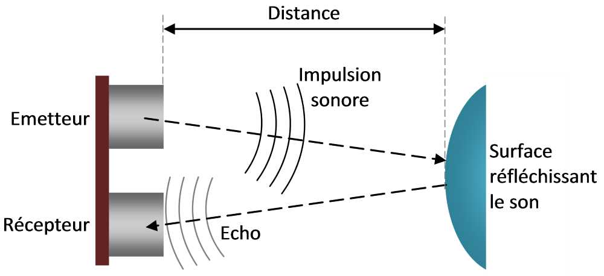

    Fonctionnement du capteur ultrasonique

Les ultrasons sont des ondes sonores (donc du bruit) qui est inaudible
par les oreilles humaines, car leur fréquence est trop élevée.
L’émetteur est donc une sorte de “corde vocale” qui chante de manière
très aigue et le récepteur est une sorte d’oreille, sensible aux
ultrasons hyper aigus. Les ultrasons, comme les sons audibles, subissent
des réflexions lorsqu’ils rencontrent des obstacles, comme un écho
sonore dans la montagne ou un tunnel. Le capteur de distance fonctionne
en mesurant le temps qu’il faut à un signal ultrasonique pour partir de
l’émetteur, se refléter sur un objet, et revenir vers le récepteur. Il
déduit ensuite la distance en se basant sur la vitesse de propagation du
son dans l’air (environ 344 mètres par seconde).

..  admonition:: Mesurer la distance avec ``getDistance()``
    :class: info

    ..  raw:: html

        

        

    La fonction ``getDistance()`` permet d’utiliser le capteur ultrasonique
    frontal du robot pour mesurer la distance à laquelle sont situés des objets
    qui se trouvent en face du robot. La plage de mesure se situe entre 3 cm et
    environ 250 cm La fonction retourne un nombre entier qui indique le nombre
    de centimètres qui séparent le capteur de la surface réfléchissant le signal
    sonore.

    ..  raw:: html

        

        

    ..  figure:: 03-capteurs/robot-capteurs-figure-1.png
        :alt: 03-capteurs/robot-capteurs-figure-1.png

        Capteur ultrasonique HC-SR04 équipant le mbRobot

    ..  raw:: html

        

        

Exemple 1
---------

Le programme ci-dessous montre comment utiliser le capteur ultrasonique
du mbRobot pour mesurer la distance à laquelle se trouve un objet.

..  raw:: html

    

    

..  code-block:: python
    :linenos:

    from mbrobot import *

    while True:
        d = getDistance()
        print(d)
        delay(200)

..  raw:: html

    

    

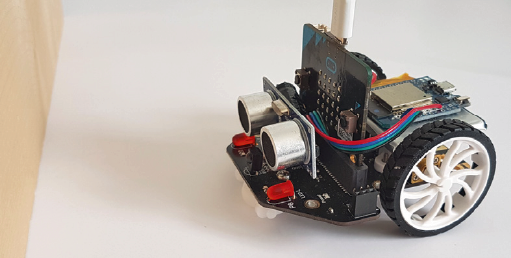

    03-capteurs/robot-capteurs-figure-2.png

..  raw:: html

    

    

On utilise la variable ``d`` pour stocker en mémoire la valeur retournée par la
fonction ``getDistance()`` et pouvoir la réutiliser plus tard dans le programme.

Comme le robot n’a pas d’écran, la fonction ``print()`` ne peut pas afficher la
valeur de la variable ``d`` sur le robot. En revanche, si le robot est branché à
l’ordinateur par le câble USB, la fonction ``print()`` affichera les valeurs
dans la fenêtre de terminal ouverte sur l’ordinateur lors de l’exécution du
programme. Lors du développement du programme, il est très utile d’utiliser la
fonction print() pour afficher les valeurs lues par le capteur dans la fenêtre
de terminal. Cela permet de trouver plus facilement les erreurs et d’améliorer
le comportement du robot.

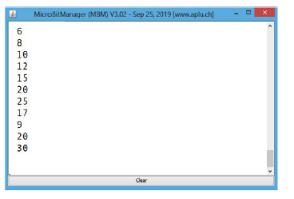

    Lecture des valeurs affichées par ``print()`` dans la fenêtre de terminal de
    TigerJython.

Déplacez l’objet à différentes distances et observer les valeurs
retournées par le capteur.

La commande ``delay(200)`` permet de régler la **période de mesure**, à savoir
l’intervalle de temps qui sépare deux mesures successives. Cette commande est
importante, car, sans elle, le processeur serait sans cesse en train de lire les
valeurs du capteur, ce qui le surchargerait inutilement.

Si aucun objet se trouve en face du robot, il retourne la valeur
maximale de 255. De ce fait, si le capteur mesure une distance de 255,
cela peut vouloir dire qu’il y a un objet à 255 cm ou qu’il n’y a pas
d’objet du tout.

..  admonition:: Nouvelles notions et commandes
    :class: info

    -   Le capteur ultrasonique permet au robot de mesurer la distance qui le
        sépare d’éventuels objets situés en face de lui, dans un **cône de
        détection** de 60 degrés, avec une plage de mesure de 3 à environ 250
        cm.

    -   La commande ``getDistance()`` retourne la valeur mesurée par le
        capteur en [cm].

    ..  figure:: 03-capteurs/robot-capteurs-figure-4.png
        :alt: 03-capteurs/robot-capteurs-figure-4.png

        La zone dans laquelle le capteur détecte les objets est appelée **cône
        de détection** du capteur. L'angle au sommet du cône mesure environ 60°.

Exemple 2
---------

En mettant en place **une stratégie de régulation**, on peut faire en
sorte que le robot soit piloter de manière à maintenir les valeurs lues
par un capteur le plus proches possible d’une **valeur cible**. Pour
cela, le robot utilise son capteur pour mesurer toutes les 100 ms la
**valeur effective** et modifie son état actuel en fonction de l’écart
entre la valeur effective et la valeur cible à atteindre.

On veut faire en sorte que le robot suive les mouvements de la main en
maintenant, autant que faire se peut, une distance de 20 cm avec la main
qui se trouve en face de lui. Lorsque la distance mesurée (valeur
effective) est inférieure à 20 cm, le robot recule et lorsqu’elle est
supérieure à 20 cm, il avance.

..  raw:: html

    

    

..  code-block:: python
    :linenos:

    from mbrobot import *

    setSpeed(20)
    while True:
        d = getDistance()
        if d < 20:
            backward()
        else:
            forward()
        delay(100)

..  raw:: html

    

    

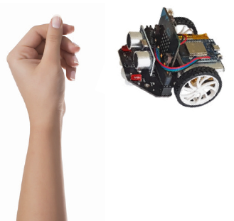

    Le robot est programme pour rester à une distance de 20 cm de l'obstacle qui
    se trouve en face du capteur.

..  raw:: html

    

    

La commande ``delay(100)`` fait en sorte que les valeurs soient lues par
le capteur toutes les 100 ms. On utilise la structure de contrôle
``if``-``else`` que vous connaissez pour faire réagir le robot
différemment en fonction de la valeur de la variable ``d``.

Activité 1
----------

..  activecode:: robot-capteurs-activite-01

    Optimisez la régulation de la distance de l’exemple 2 de la manière
    suivante: lorsque la main est trop éloignée (:math:`d > 50`) ou que la
    main se trouve en dehors du cône de détection, le robot doit s’arrêter.
    Dès qu’il détecte à nouveau la main ou qu’elle se trouve à une distance
    inférieure à 50 cm, il recommence à la suivre.

    ..  admonition:: Indication

        Rajoutez pour cela une clause ``elif`` dans la structure
        conditionnelle.

    ~~~~
    from mbrobot import *

Activité 2
----------

..  activecode:: robot-capteurs-activite-02

    Placez un objet une distance de 50 cm en face du robot. Écrivez un programme
    qui fait avancer le robot à une vitesse de 30 et qui mesure la distance de
    l’objet toutes les 100 ms. Dès que la distance mesurée est inférieure à 20
    cm, le robot doit faire sonner son alarme. Dès que la distance est
    inférieure à 10 cm, le robot doit s’arrêter.

    ~~~~
    from mbrobot import *

Activité 3
----------

..  activecode:: robot-capteurs-activite-03

    Placez le robot entre deux obstacles relativement grands et faites en
    sorte qu’il fasse un mouvement de va-et-vient. Dès que la distance avec
    l’obstacle est inférieure à 20 cm, le robot doit s’arrêter et faire
    sonner l’alarme pendant une seconde. Il doit ensuite effectuer une
    rotation de 180 degrés sur lui-même et avancer dans la direction
    opposée. Il réagir de la même manière à l’approche du second obstacle et
    continuer ainsi de suite indéfiniment.

    ..  figure:: 03-capteurs/robot-capteurs-figure-6.png
        :alt: 03-capteurs/robot-capteurs-figure-6.png

    ~~~~
    from mbrobot import *

Activité 4 (uniquement robot EV3)
---------------------------------

..  reveal:: EC93782D-549F-4D07-8684-5F4AE72AE7DD
    :showtitle: Afficher l'exercice (uniquement EV3)

    ..  admonition:: Exercice ne fonctionnant qu'avec un robot EV3
        :class: attention

        Cet exercice ne peut être fait qu’avec un robot EV3, car il nécessite un
        capteur ultrasonique sur le côté du robot et un bouton poussoir à
        l’avant du robot. On peut adapter l’exercice au robot Maqueen en plaçant
        le capteur de distance sur le côté droit du robot. Pour cela, il faut
        des fils électriques (câble Dupont de 10cm mâle-femelle reliant le
        capteur au port noté ``SR04`` sur le robot Maqueen) et du scotch pour
        fixer le capteur ultrasonique sur le côté du robot.

    ..  activecode:: robot-capteurs-activite-04

        Le robot doit pouvoir suivre les parrois de la salle de classe en
        maintenant une certaine distance. Utilisez le capteur tactile du robot
        EV3 pour détecter un choc avec la parroi avant, arrêter le robot,
        tourner à gauche de 90 degrés et continuer de suivre le prochain mur.

        ..  figure:: 03-capteurs/robot-capteurs-figure-7.png
            :alt: 03-capteurs/robot-capteurs-figure-7.png

        Avec le robot Maqueen, on peut détecter la collision avec la parroi en
        face du robot à l’aide de l’accéléromètre. Vous pourrez donc réaliser
        cet exercice dès que vous saurez lire les valeurs de l’accéléromètre du
        micro:bit.

        ~~~~
        from mbrobot import *

Activité 5
----------

..  activecode:: robot-capteurs-activite-05

    Enfermez le robot dans une “prison” formée de murs de tous côtés, mais
    avec une ouverture suffisamment grande pour permettre au robot de
    s’échapper. Mettez en place une stratégie permettant au robot de trouver
    la sortie et de s’échapper. Écrivez ensuite un programme qui implémente
    cette stratégie. Les obstacles peuvent par exemple être des livres ou
    des parois en carton que vous tenez à la main.

    ~~~~
    from mbrobot import *

Question de réflexion concernant l'exercice
+++++++++++++++++++++++++++++++++++++++++++

..  shortanswer:: 30071726-0399-4900-BCE4-038F52AB7CAD

    Votre stratégie fonctionne-t-elle quel que soit l'emplacement initial du robot
    dans sans "cage" ? Essayez de trouver une forme de cage, un emplacement et une
    orientation initiale qui font échouer votre stratégie.

Mesurer la luminosité avec des capteurs infrarouges
===================================================

Sous le robot Maqueen (mbRobot), il y a deux capteurs infrarouges
permettant de déterminer si le sol est clair ou foncé. Un capteur
infrarouge est un composant photosensible composé d’une LED qui émet de
la lumière dans l’infrarouge, et une photodiode qui mesure l’intensité
de la lumière réfléchie par le sol. Le mbRobot dispose de deux capteurs
infrarouges (Line-R et Line-L). Comme la lumière infrarouge est
réfléchie différemment par des surfaces claires et foncées, ces capteurs
ne fournissent que les valeurs 0 (foncé) et 1 (clair).

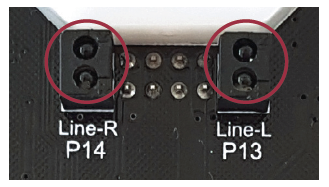

    Capteurs infrarouges du mbRobot, sous le châssis du robot.

Exemple 3
---------

On veut faire en sorte que le robot se serve de ses capteurs infrarouges
pour suivre le bord d’une surface foncée. En fonction de la valeur
détectée par le capteur (clair ou foncé), le robot corrige sa
trajectoire en effectuant un court arc de cercle d’un côté ou de
l’autre. Les capteurs sont lus indéfiniment, dans une boucle infinie,
avec une période de mesure de 100 ms. Pour mesurer l’intensité lumineuse
réfléchie et la stocker dans une variable ``mesure``, on utilise la
commande

..  code-block:: python

    mesure = irLeft.read_digital()

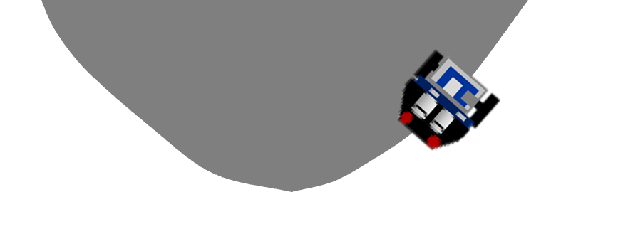

    Utilisation des capteurs infrarouges pour suivre le bord d'une surface
    foncée sur fond clair.

..  code-block:: python
    :linenos:

    from mbrobot import *

    # Commandes à décommenter en mode simulé
    # RobotContext.useBackground("sprites/blackarea.gif")
    # RobotContext.setStartPosition(120, 400)

    setSpeed(30)
    while True:
        mesure = irLeft.read_digital()
        if mesure == 0:
            leftArc(0.2)
        else:
            rightArc(0.2)
        delay(100)

..  admonition:: Informations concernant le mode simulé
    :class: info

    En mode simulé, vous pouvez supprimer les commentaires des lignes 4 et 5
    pour utiliser une surface foncée et placer le robot à une position initiale
    appropriée. La première commande charge un “sol virtuel” avec une surface
    noire et la deuxième commande place le robot aux coordonnées :math:`(120,
    400)`. La fenêtre de simulation fait 500x500 pixels et l’origine :math:`(0,
    0)` se trouve au coin supérieur gauche. Les images de fond (sols virtuels)
    sont livrés avec TigerJython et vous pouvez en consulter la liste dans la
    documentation sous Aide ⇒ Documentation APLU ⇒ Bibliothèques des images ⇒
    Aperçu. Vous pouvez aussi définir vos propres sols virtuels en plaçant une
    image un dossier nommé ``sprites``, dans le même dossier que votre programme
    Python.

..  admonition:: Informations concernant le mode réel
    :class: info

    En mode réel, il faut commenter les deux lignes ``RobotContext``, car
    elles ne seraient pas comprises par le robot.

    En mode réel, le robot se déplace généralement trop vite avec la vitesse
    standard. Il faut donc réduire sa vitesse avec ``setSpeed(20)``.

Vous pouvez déjà observer, en mode simulé, que si le rayon de l’arc de cercle
est trop petit (par exemple 0.05), le robot se déplace très lentement et de
manière saccadée. En revanche, si le rayon est trop élevé (par exemple 0.6), il
perd souvent la trace de la surface.

Question de réflexion 6
-----------------------

..  shortanswer:: robot-capteurs-activite-06-comprehension

    Que se passe-t-il si vous placez le robot dans l’autre sens sur le bord
    de la surface foncée?

Nouvelles notions et Commandes
------------------------------

..  admonition:: Commandes pour lire les valeurs des capteurs infrarouges
    :class: info

    -   La commandes ``irLeft.read_digital()`` retourne l’intensité lumineuse
        réfléchie par le sol sur le capteur infrarouge gauche situé sous le
        châssis du robot Maqueen.

    -   La commandes ``irRight.read_digital()`` retourne l’intensité
        lumineuse réfléchie par le sol sur le capteur infrarouge droit situé
        sous le châssis du robot Maqueen.

Exemple 4
---------

Les voitures autonomes sont déjà presque une réalité. Pour réguler les
mouvements de la voiture en toute situation, il faut mettre en place un
processus de régulation nécessitant de grosses quantités de données en
provenance des capteurs. Cet exemple présente une situation extrêmement
simplifiée de ce processus. Le robot Maqueen, équipé de deux capteurs
infrarouges, doit suivre une ligne foncée.

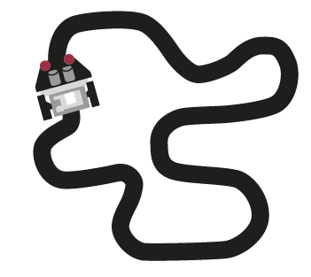

    Utilisation des capteurs infrarouges pour suivre un trajet compliqué de
    manière autonome.

Développez une stratégie de régulation qui contrôle le robot afin qu’il
suive la ligne le plus précisément possible. Utilisez les deux capteurs
pour que le robot ne perde pas la trace de la ligne. Cela permet au
robot de savoir s’il doit avancer tout droit ou corriger sa trajectoire
avec un arc de cercle à gauche ou à droite.

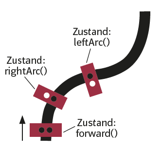

    Les valeurs lues par les capteurs infrarouges permettent de savoir s'il faut
    avancer tout droit, tourner à gauche ou à droite.

..  code-block:: python
    :linenos:

    from mbrobot import *

    # Commandes à décommenter en mode simulé
    # RobotContext.useBackground("sprites/trail.gif")
    # RobotContext.setStartPosition(250, 250)

    setSpeed(30)
    while True:
        vL = irLeft.read_digital()
        vR = irRight.read_digital()

        if vL == 0 and vR == 0:
            forward()
        elif vL == 1 and vR == 0:
            rightArc(0.1)
        elif vL == 0 and vR == 1:
            leftArc(0.1)
        delay(100)

Question de réflexion 7
-----------------------

..  shortanswer:: robot-capteurs-activite-07-comprehension

    Le robot, équipé de deux capteurs, peut-il également parcourir le chemin
    à l’envers en utilisant le même programme?

Question de réflexion 8
-----------------------

..  shortanswer:: robot-capteurs-activite-08-comprehension

    Que se passe-t-il si l’on augmente la vitesse de déplacement du robot ?

Exemple 5
---------

Les chemins qui contiennent des intersections sont plus délicats pour le
contrôle du robot. Même en choisissant la vitesse de déplacement et le
rayon des arcs de cercles de manière optimale, il est très probable que
le robot sorte du chemin et n’en retrouve plus la trace. Un exemple
typique de chemin qui pose ce problème est le “huit”.

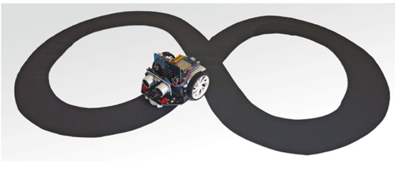

    Un croisement qui a bien des chances de poser problème

Une possibilité d’éviter ce problème est de faire reculer le robot s’il
sort du chemin jusqu’à ce qu’il retrouve la trace du chemin. Améliorez
votre programme avec une clause ``elif`` qui prend en compte le cas où
les deux capteurs mesurent un sol clair.

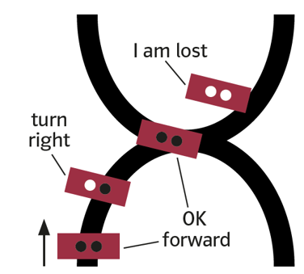

    Stratégie à mettre en place si le robot est perdu.

..  admonition:: Informations pour le mode simulé
    :class: info

    Pour le mode simulé, vous pouvez utiliser l’image ``sprites/track.gif``
    et placer le robot à la position initiale :math:`(250, 250)`.

..  admonition:: Code complet

    ..  code-block:: python
        :emphasize-lines: 20-23

        from mbrobot import *

        simulation = True

        if simulation == True:
            RobotContext.useBackground("sprites/trail.gif")
            RobotContext.setStartPosition(250, 250)

        setSpeed(30)
        while True:
            vL = irLeft.read_digital()
            vR = irRight.read_digital()

            if vL == 0 and vR == 0:
                forward()
            elif vL == 1 and vR == 0:
                rightArc(0.1)
            elif vL == 0 and vR == 1:
                leftArc(0.1)
            elif vL == 1 and vR == 1:
                backward()
                delay(100)
                rightArc(0.2)
            delay(100)

Activité 9
----------

..  activecode:: robot-capteurs-activite-09

    Programmer le robot pour qu’il parcoure plusieurs fois un trajet
    rectiligne dessiné par terre de manière foncée et, une fois arrivé à
    l’extrémité, fasse un demi-tour sur lui-même et reparte dans le sens
    opposé.

    ..  admonition:: Information

        Pour le mode simulé, vous pouvez utiliser le sol virtuel
        ``sprites/blacktapes.gif`` et la position de départ :math:`(420, 400)`.
        
    ~~~~
    from mbrobot import *

Activité 10
-----------

..  activecode:: robot-capteurs-activite-10

    Utilisez du ruban adhésif noir pour inventer votre propre parcours par
    terre. Écrivez ensuite un programme permettant au robot de suivre cette
    trajectoire.

    ~~~~
    from mbrobot import *

Exemple 6
---------

Dans le chapitre précédent, vous avez pu observer qu’il est difficile de
faire suivre au robot une trajectoire vraiment carrée. Dans cet exemple,
nous allons utiliser une autre stratégie consistant à utiliser les
capteurs du robot pour corriger sa trajectoire lorsqu’il en dévie. Dans
cet exemple, le robot doit se déplacer le long d’une trajectoire carrée
en utilisant ses deux capteurs infrarouges.

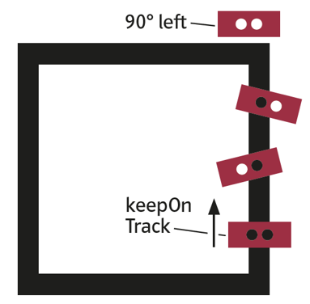

    Utiliser les capteurs infrarouges pour parcourir un trajet carré de manière
    précise

Pour mieux structurer le programme, on peut définir une commande
``keep_on_track()`` qui fait avancer le robot tout en faisant en sorte qu’il
reste sur la bande foncée. Il faut changer de direction à chaque sommet du
carré. Dès que les deux capteurs détectent du blanc, il se tourne d’environ 90
degrés vers la gauche (ou vers la droite) et continue d’avancer.

..  code-block:: python
    :linenos:

    from mbrobot import *

    # Commandes à décommenter en mode simulé
    RobotContext.useBackground("sprites/field1.gif")
    RobotContext.setStartPosition(385, 400)

    def keep_on_track(vL, vR):
        if vL == 0 and vR == 0:
            forward()
        elif vL == 0 and vR == 1:
            leftArc(0.2)
        elif vL == 1 and vR == 0:
            rightArc(0.2)

    while True:
        vL = irLeft.read_digital()
        vR = irRight.read_digital()

        if vL == 1 and vR == 1:
            # tourner de 90 degrés
            left()
            # valeur à adapter en mode réel
            delay(550)
        else:
            keep_on_track(vL, vR)

        delay(100)

Activité 11
-----------

..  attention:: 

    Il vaut mieux ne pas faire cette activité sur une table avec le robot
    Maqueen, car il ne pourrait pas détecter le bord de la table avant de tomber
    en raison de la position assez reculée des capteurs infrarouges.

..  activecode:: robot-capteurs-activite-11

    Écrivez un programme qui déplace le robot sur une table claire sans
    qu’il n’en tombe. Lorsque le robot arrive au bord de la table, il n’y
    aura plus de lumière réfléchie puisqu’il n’y a plus de “sol”
    réfléchissant. De ce fait, le robot aura l’impression de voir du noir. À
    ce moment, faites en sorte que le robot évite de tomber de la table en
    reculant de quelques centimètres, tourne d’environ 90 degrés et continue
    d’avancer.

    ..  figure:: 03-capteurs/robot-capteurs-activite-11.png
        :width: 30%

    ..  admonition:: Informations pour le mode simulé
        :class: info

        En mode simulé, vous pouvez utiliser le sol virtuel ``sprites/circle.gif``
        et les coordonnées de départ :math:`(250, 200)`.

    ~~~~
    from mbrobot import *

Activité 12
-----------

..  activecode:: robot-capteurs-activite-12

    Un robot équipé d’un capteur ultrasonique frontal effectue lentement une
    rotation sur lui-même. Dès qu’il détecte un obstacle, il doit s’en approcher
    et s’arrêter juste avant de le toucher.

    ..  figure:: 03-capteurs/robot-capteurs-figure-12.png
        :alt: 03-capteurs/robot-capteurs-figure-12.png
        :width: 40%

        Recherche d'un obstacle avec le capteur ultrasonique

    La commande ``search_target()`` implémente ce comportement de la manière
    suivante :

    -   le robot effectue de petites rotation sur lui-même

    -   à chaque rotation, il mesure la distance à l’objet et la stocke dans
        la variable ``distance``

    -   lorsqu’il détecte un objet (:math:`d < 255`), il continue encore de
        tourner un peu et interrompt la recherche avec ``break``.
        
    -   Il se rapproche ensuite de l’objet avec la commande ``forward()``.

    Complétez le programme ci-dessous avec une deuxième boucle infinie qui permet au
    robot de mesurer la distance à l’objet en avançant et de s’arrêter lorsque
    celle-ci devient inférieure à 20 cm.

    ..  admonition:: Objets en mode simulé
        :class: info

        Il est possible de simuler des objets en mode simulé. Pour cela, il faut
        décommenter les lignes ``RobotContext`` et celle qui définit la liste de
        coordonnées ``mesh`` (maillage). Les coordonnées en question permettent
        de définir les sommets de l’objet à prendre en compte dans le monde
        virtuel comme si cet objet était centré à l’origine. En faisant appel la
        méthode ``RobotContext.useTarget()``, on spécifie en plus les
        coordonnées de l’objet en question dans l’image ``redtarget.gif``.

        ..  figure:: 03-capteurs/robot-capteurs-figure-13.png
            :alt: 03-capteurs/robot-capteurs-figure-13.png

            Définition du maillage permettant au mode simulé de simuler la
            présence d'un objet

    ~~~~
    from mbrobot import *

    def search_target():
        while True:
            right()
            delay(50)
            distance = getDistance()
            
            # en mode simulation, le capteur produit -1 si aucun objet n'est détecté
            simulation_found_target = simulation_mode == True and distance != -1
            # en mode réel, le capteur produit la valeur 255 si aucun objet n'est détecté
            real_found_target = simulation_mode == False and distance < 255
            # cette condition fonctionne en mode simulation et sur le robot physique 
            if simulation_found_target or real_found_target:
                right()
                delay(500)
                break
            

    def main():
        setSpeed(10)
        search_target()
        forward()

    simulation_mode = True

    if simulation_mode:
        mesh = [(50,0),(25,43),(-25,43),(-50,0),(-25,-43),(25,-43)]
        RobotContext.useTarget("sprites/redtarget.gif", mesh, 400, 400)
        

    main()

Résumé
======

À l’aide de capteurs, le robot peut effectuer différentes mesures. Il
peut mesurer la distance aux objets, mesurer l’intensité lumineuse, etc.
Données lues depuis les capteurs peuvent être stockées dans des
variables. Le robot peut prendre des décisions et passer à différents
états en fonction des valeurs des variables. On peut ainsi programmer
des comportements en fonction des caractéristiques locales de
l’environnement du robot. Si un robot met en œuvre de manière
indépendante une telle stratégie, on dit qu’il a un **comportement
autonome**.

Voici les commandes présentées dans ce chapitre

Dans ce chapitre, vous avez appris les commandes suivantes:

..  list-table:: Liste des commandes abordées dans ce chapitre
    :widths: 30 35
    :align: left
    :header-rows: 1

    * - Commande / syntaxe
      - Signification

    * - ``getDistance()``
      - Retourne la distance mesurée par le capteur ultrasonique.

    * - ``irLeft.read_digital()``
      - Retourne l’intensité lumineuse mesurée par le capteur infrarouge gauche
        du robot.

    * - ``irRight.read_digital()``
      - Retourne l’intensité lumineuse mesurée par le capteur infrarouge gauche
        du robot.

    * - ``RobotContext.useBackground("sprites/image")``
      - Utilise le “sol virtuel” indiqué par le fichier image
        ``"sprites/image"``. Les fichiers images en question sont généralement
        des fichiers .GIF

    * - ``mesh = [(x1, y1), (x2, y2), (x3, y3), ...]``
      - Définit, dans le mode simulation, les coordonnées du polygone qui
        représente l’objet à détecter.

    * - ``RobotContext.useTarget``
      - En mode simulé, définit l’image de fond du monde virtuel et la position
        du centre du polygone qui représente l’objet à détecter.

Auto-évaluation
===============

Concepts et commandes
---------------------

Question 1
++++++++++

..  shortanswer:: robot-capteurs-comprehension-01

    Expliquez le fonctionnement d’un capteur ultrasonique

Question 2
++++++++++

..  shortanswer:: robot-capteurs-comprehension-02

    Quelle est la commande permettant au robot de lire une valeur du capteur
    ultrasonique ?

Question 3
++++++++++

..  shortanswer:: robot-capteurs-comprehension-03

    Quel est le capteur qui permet au robot de savoir s’il se trouve sur une
    surface foncée ou claire ?

Question 4
++++++++++

..  shortanswer:: robot-capteurs-comprehension-04

    Décrivez une situation où il est utile d’utiliser plusieurs capteurs du même
    type.

Exercices
---------

Exercice 1
++++++++++

..  activecode:: robot-capteurs-exercice-01

    Programmez le robot pour qu'il adopte le comportement suivant:

    -   Au début, le robot ne se déplace pas
    -   Dès qu’un objet s’approche de lui par l’avant, il commence à faire
        clignoter ses LEDs

    -   Si l’objet continue de se rapprocher, le robot fait sonner l’alarme
    -   Si l’objet s’éloigne, le robot fait clignoter ses LEDs jusqu'à ce que
        la distance à l’objet soit supérieure à 50 cm.

    ~~~~
    from mbrobot import *

Exercice 2
++++++++++

..  activecode:: robot-capteurs-exercice-02

    Lorsqu’une fourmi s’écarte de la piste empruntée par les autres fourmis,
    elle utilise la stratégie suivante pour la retrouver : elle se tourne
    d’environ 90 degrés vers la droite et se déplace ensuite sur un arc de
    cercle jusqu’à ce qu’elle retrouve la route. Dessinez une “piste de fourmis”
    en papier ou avec du ruban adhésif et programmez le comportement décrit
    ci-dessus à l’aide de la commande ``keep_on_track()`` de l’exemple 6.

    ..  figure:: 03-capteurs/robot-capteurs-figure-14.png
        :alt: 03-capteurs/robot-capteurs-figure-14.png
        :width: 40%

        Trace que le robot doit suivre

    ~~~~
    from mbrobot import *

..  reveal:: 1B57D1FD-AC67-44B8-ADF4-30CAB474C87B
    :showtitle: Indice 1

    Voici une indication visuelle pour vous aider à passer d'un bout de trace au
    suivant.

    ..  figure:: 03-capteurs/exercice-02-hint.gif
        :width: 40%
        
        Conseil pour passer d'un bout de trace au suivant

    

Exercice 3
++++++++++

..  activecode:: robot-capteurs-exercice-03

    Un robot équipé d’un capteur ultrasonique se trouve dans l’espace défini
    par les 12 parois A, B, …, K, L. On peut créer une ouverture en enlevant
    n’importe laquelle des parois. Développez une stratégie permettant au
    robot de s’échapper, quel que soit son point de départ et quelle que
    soit la paroi supprimée.

    Développez ensuite un programme qui implémente votre stratégie et
    testez-la dans différents scénarios (positions de départ, paroi
    supprimée).

    ..  figure:: 03-capteurs/robot-capteurs-figure-15.png
        :alt: 03-capteurs/robot-capteurs-figure-15.png
        :width: 50%

        Schéma de la situation

    ~~~~
    from mbrobot import *
