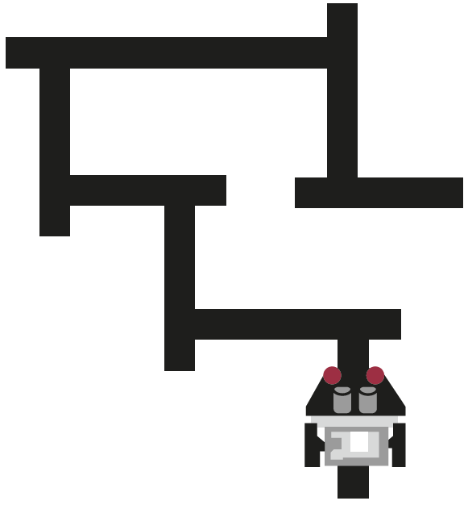

Le robot auto-apprenant
#######################

..  qnum::
    :prefix: q-
    :start: 1

Introduction
============

Comment un robot peut-il apprendre tout seul ?
==============================================

Les robots sont utilisés dans des tâches de plus en plus complexes qui
nécessitent des systèmes intelligents et adaptatifs. Par exemple, on utilise des
robots en chirurgie pour effectuer des opérations délicates, des robots
industriels dans les chaînes de montage, ou des robots d’assistance permettant
d'aider des personnes invalides à recouvrer certaines fonctions motrices. Plus
l’activité est complexe, plus le robot doit être capable de traiter des données
et d’en tirer des décisions “intelligentes”, afin de pouvoir réagir avec
souplesse à des situations imprévues. Les robots industriels sont souvent
“formés” par l’homme à leurs tâches, en mémorisant certaines séquences
d’actions, puis en les rejouant de manière autonome. Les systèmes robotiques
modernes et plus puissants peuvent utiliser une variété de données pour
optimiser progressivement leur comportement et en initier de nouveaux, plus
complexes. De tels systèmes utilisent ce que l’on appelle des **réseaux de
neurones artificiels**, qui sont conçus pour imiter le fonctionnement du cerveau
humain et permettre l’apprentissage. De tels systèmes d’apprentissage sont au
cœur de la fulgurante accélération du domaine de l’intelligence artificielle
(IA) ces dernières années. Ils permettent de relier constamment des instructions
(programmes) et des connaissances (données) provenant de nombreuses sources
imbriquées et de créer ainsi de nouvelles façons de résoudre un problème. Afin
de pouvoir traiter de grandes quantités de données de manière pertinente, il est
nécessaire, d’une part, de réduire la complexité (c’est-à-dire d’omettre les
informations non importantes) et, d’autre part, d’analyser les données
existantes. L’identification de “motifs” (*patterns* en anglais) présents dans
les données est essentielle pour extraire de la connaissance des données et
réaliser des apprentissages, faire des prédictions et préparer, voire
automatiser, les décisions. L’apprentissage automatique est un exemple de ce
type de processus d’analyse intelligent.

Les robots utilisés dans ce livre sont également capables d’apprendre.
Dans ce chapitre, vous apprendrez à les programmer et à les entraîner à
certaines tâches.

Dans l’industrie et l’ingénierie, les programmes pour les robots sont
généralement développés en premier lieu à l’aide d’environnements de simulation,
qui permettent de tester les programmes plus efficacement et de réduire les
coûts matériels. L’environnement de programmation TigerJython fournit un tel
environnement de simulation, nommé “mode simulation”, qui permet de simuler
presque toutes les fonctionnalité du robot Maqueen.

Comment un robot peut-il apprendre ?
====================================

Par “apprentissage”, on entend, d’une part, l’acquisition et le stockage
de connaissances et, d’autre part, le processus permettant de réagir à
des situations spécifiques par l’expérience acquise, de manière
perspicace, et d’adapter spontanément notre comportement. Le
comportement des robots est souvent basé sur des informations issues de
leur mémoire. La mémoire peut être considérée comme un souvenir.
Cependant, contrairement à un robot, notre mémoire à long terme dispose
d’un espace de stockage extrêmement important. Par les exemples de ce
chapitre, vous allez apprendre à programmer le robot Maqueen de manière
à ce qu’il puisse

1.  utiliser des informations stockées
2.  stocker des informations transmises par un “professeur”
3.  utiliser de manière autonome ses capteurs pour stocker les
    informations dont il a besoin pour une tâche particulière
    (“auto-apprentissage”).

Pour stocker les informations collectées à l’aide des capteurs, vous
utiliserez les listes Python.

Exemple 1
---------

..  raw:: html

    

    

Un robot doit se déplacer le long d’un chemin comportant des virages à angle
droit à l’aide d’informations qu’on lui fournit avant le lancement du programme.
À chaque virage, il doit savoir s’il doit tourner à gauche ou à droite, car, à
chaque embranchement, l’une des deux possibilités mêne à un cul-de-sac. Ces
informations lui sont transmises à l’aide d’une liste ``memory``. Un élément de
la liste ``memory`` signifie “tourner à gauche” s’il vaut 0 et “tourner à
droite” s’il vaut 1.

Dans le programme ci-dessous, la liste ``memory = [0, 1, 0]`` stocke le
choix à faire à chacune des trois premières intersections. Le robot doit
donc tourner d’abord à gauche (0), puis à droite (1), puis à nouveau à
gauche (0).

..  raw:: html

    

    

     Trajet que le robot doit parcourir

..  raw:: html

    

    

..  raw:: html

    

    

Pour mieux structurer le programme, on définit la commande ``keep_on_track()``,
déjà connue du précédent chapitre, ainsi que les commande ``turn_left()`` et
``turn_right()`` qui font tourner le robot à gauche, respectivement à droite de
90 degrés.

Le programme principal fait en sorte que le robot suive le parcours défini par
la liste ``memory``. Pour ce faire, les capteurs sont sans cesse interrogés à
intervalles réguliers au sein d’une boucle infinie ``while True:``, afin que le
robot reste sur le chemin à parcourir.

..  admonition:: Terme technique : polling

    Cette technique de lecture des valeurs du capteur à intervalles
    réguliers est appelée *polling*.

Le robot reconnaît un croisement lorsque ses deux capteurs renvoient
tous deux “clair”. Dans ce cas, le robot s’arrête et consulte le
prochain élément dans la liste ``memory``. Il tourne ensuite de 90
degrés à gauche ou à droite selon la valeur extraite de la liste. Vous
savez que l’on peut accéder aux éléments d’une liste par leur position
(index). Le premier élément de la liste est ``memory[0]``, le deuxième
``memory[1]``, le troisième ``memory[2]`` et ainsi de suite. Une fois
que tous les éléments de la liste memory ont été consultés et pris en
compte, la boucle infinie est interrompue avec le mot-clé ``break``, ce
qui a pour effet d’arrêter le robot.

..  raw:: html

    

    

..  code-block:: python
    :linenos:

    from mbrobot import *

    # Configuration du mode simulation
    # (commenter en mode réel)
    RobotContext.setStartPosition(
        385, 490)
    RobotContext.useBackground(
        "sprites/learntrack1.gif")

    def keep_on_track(vL, vR):
        if vL == 0 and vR == 0:
            forward()
        elif vL == 0 and vR == 1:
            leftArc(0.1)
        elif vL == 1 and vR == 0:
            rightArc(0.1)
            
    def turn_left():
        left()
        delay(900)
        
    def turn_right():
        right()
        delay(900)
        
    def run():    
        memory = [0, 1, 0]
        n = 0
        setSpeed(30)
        
        while True:
            vR = irRight.read_digital()
            vL = irLeft.read_digital()
            keep_on_track(vL, vR)
            if vL == 1 and vR == 1:
                stop()
                if len(memory) == n:
                    break
                
                if memory[n] == 0:
                    turn_left()
                else:
                    turn_right()
                    
                n += 1
        stop()
            
    run()

..  raw:: html

    

    

..  admonition:: Révision : accès aux éléments d’une liste

    Pour rappel, on peut accèder aux éléments individuels d’une liste à l’aide
    de **l’opérateur d’indexation** ``[]``.

    Les éléments sont numérotés (on dit *indexés* dans le jargon de la
    programmation) à partir de zéro. Le premier élément de la liste est
    donc situé à la position 0.

    -  Accéder l’élément de la liste à la position :math:`n`

    ..  code-block:: python

        element = memory[n]

    -  Accéder au premier élément de la liste

    ..  code-block:: python

        first_element = memory[0]

    -  Accéder au dernier élément de la liste

    ..  code-block:: python

        # première manière (longue)
        last_element = memory[len(memory) - 1]
        # deuxième manière
        last_element = memory[-1]

Exercice 1
----------

..  activecode:: robot-apprenant-activity-01

    Complétez la liste ``memory`` avec des 0 et des 1 pour que le robot suive le
    tracé jusqu’au bout. Enregistrez ensuite votre programme dans un fichier
    ``self_learning_robot.py``, car vous en aurez besoin par la suite.

    ~~~~
    from mbrobot import *

Nouveaux concepts et exercices
------------------------------

Les robots peuvent stocker les informations     dont ils ont besoin pour accomplir
une tâche donnée et les réutiliser en cas de besoin.

Exemple 2
---------

Les robots industriels sont entraînés en “mode apprentissage” par un “coach”
humain expert dans la tâche à accomplir. Par exemple, dans une chaîne de montage
de voitures, les mouvements à effectuer par un bras robotisé sont programmés en
détails à l’avance. Pour ce faire, le coach utilise généralement des actionneurs
tels que des boutons permettant de programmer le mouvement très minutieusement
ou une télécommande. Lors de cette phase d’apprentissage, le coach place
continuellement le robot dans l’état dans lequel il doit se trouver à chaque
étape de l’action à effectuer. Toutes les étapes du mouvement sont enregistrées
par le robot.

Pour programmer le robot Maqueen, vous utiliserez dans cet exemple les boutons A
(gauche) et B (droite) de la carte micro:bit qui pilote le robot. Vous pouvez
influencer le comportement du robot à l’aide des boutons pendant l’exécution de
la tâche, de manière interactive. Cette technique de programmation est appelée
**programmation événementielle**. Les commandes ``turn_left()`` et
``turn_right()`` ne sont pas appelées directement par le programme lui-même,
mais par le système (robot), en réaction à une pression sur l’un des boutons.
Ces commandes ``turn_left()`` et ``turn_right()`` sont alors, dans ce contexte,
appelées **fonctions de rappel** (*callback functions* en anglais). On utilise
la même technique de programmation dans tous les programmes bénéficiant d’une
**interface graphique** (*Graphical User Interface = GUI* en anglais), pour
réagir aux événements de la souris, du clavier ou de l’écran tactile.

..  admonition:: Information pour le mode simulé
    :class: info

    En mode simulation, cliquez sur le bouton A ou B du micro:bit virtuel
    qui s’affiche à l’écran avec le bouton gauche de la souris pour
    enseigner au robot le choix à effectuer à chaque intersection

    ..  raw:: html

        

        

    ..  figure:: 04-robot-apprenant/robot-apprenant-0.png
        :alt: 04-robot-apprenant/robot-apprenant-0.png

        **En mode réel**, il faut appuyer sur les boutons A (gauche) ou B (droite)
        pour diriger le robot

    ..  raw:: html

        

        

    ..  figure:: 04-robot-apprenant/robot-apprenant-1.png
        :alt: 04-robot-apprenant/robot-apprenant-1.png

        **En mode simulation**, il faut cliquer avec la souris sur le bouton A
        ou B sur la représentation virtuelle du micro:bit (souvent cachée
        derrière la fenêtre de simulation du robot dans le coin supérieur droit
        de l’écran).

    ..  raw:: html

        

        

Ce programme fait à nouveau du polling en interrogeant les capteurs infrarouges
à intervalles réguliers, au sein d’une boucle infinie, pendant que la commande
``keep_on_track()`` permet au robot d’avancer en suivant les lignes noires. Dès
que le robot parvient à un croisement (les deux capteurs à 1), le robot
s’arrête. Ensuite, l’opérateur coach peut indiquer au robot dans quelle
direction tourner en appuyant sur le bouton A ou B du micro:bit. Le robot
exécute alors la commande ``turn_left`` ou ``turn_right`` en fonction du bouton
pressé, puis enregistre la direction empruntée dans la liste ``memory`` avec
``memory.append()`` pour rajouter la nouvelle valeur en fin de liste. Au début,
la variable ``memory`` est initialisée à la liste vide (``memory = []``). Après
chaque exécution de la boucle, le contenu de la liste ``memory`` est affiché
dans le terminal avec ``print(memory)``.

Code du programme
~~~~~~~~~~~~~~~~~

..  code-block:: python
    :linenos:

    from mbrobot import *
    from microbit import *

    # Configuration du mode simulation (commenter en mode réel)
    RobotContext.setStartPosition(385, 490)
    RobotContext.useBackground("sprites/learntrack1.gif")

    def keep_on_track(vL, vR):
        if vL == 0 and vR == 0:
            forward()
        elif vL == 0 and vR == 1:
            leftArc(0.1)
        elif vL == 1 and vR == 0:
            rightArc(0.1)
            
    def turn_left():
        left()
        delay(900)
        
    def turn_right():
        right()
        delay(900)
        
    def learn():    
        memory = []
        n = 0
        setSpeed(30)
        
        while not (button_a.is_pressed() and button_b.was_pressed()):
            vL = irLeft.read_digital()
            vR = irRight.read_digital()
            keep_on_track(vL, vR)
            
            if vL == 1 and vR == 1:
                stop()
                if button_a.was_pressed():
                    turn_left()
                    memory.append(0)

                if button_b.was_pressed():
                    turn_right()
                    memory.append(1)
        
                print(memory)
                
    learn()

On peut terminer la phase d’apprentissage en appuyant simultanément sur
les boutons A et B du micro:bit. En mode simulation, il n’est pas
possible de cliquer simultanément sur les deux boutons et il faut donc
d’abord cliquer sur le bouton A avec le **bouton droit** de la souris,
puis sur le bouton B avec le **bouton gauche** de la souris. La boucle
de la phase d’apprentissage tourne à l’infini tant que les deux boutons
du micro:bit ne sont pas enfoncés.

Lorsque la phase d’apprentissage est terminée, le robot a enregistré
tous les changements de direction dans la liste ``memory`` et peut
suivre le tracé de manière autonome en exécutant la commande ``main()``
du programme de l’exemple 1.

..  admonition:: Informations pour le mode simulation
    :class: info

    En mode simulation, on peut utiliser la commande ``reset()`` pour
    remettre le robot à sa position de départ. Pour avoir le temps de
    repositionner le robot en début de parcours en mode réel, mettez le
    programme en pause jusqu’à ce qu’une pression sur le bouton B soit
    détectée.

    ..  code-block:: python

        while not button_b.was_pressed():
            delay(50)

Programme complet
~~~~~~~~~~~~~~~~~

Voici le programme complet contenant la phase d’apprentissage et la
phase d’exécution.

..  code-block:: python
    :linenos:

    from mbrobot import *
    from microbit import *

    # Configuration du mode simulation (commenter en mode réel)
    RobotContext.setStartPosition(385, 490)
    RobotContext.useBackground("sprites/learntrack1.gif")

        
    # Constantes
    MODE_SIMULATION = 0
    MODE_REAL = 1

    def keep_on_track(vL, vR):
        if vL == 0 and vR == 0:
            forward()
        elif vL == 0 and vR == 1:
            leftArc(0.1)
        elif vL == 1 and vR == 0:
            rightArc(0.1)
            
    def turn_left():
        left()
        delay(900)
        
    def turn_right():
        right()
        delay(900)
        
    def learn(memory):    
        while not (button_a.is_pressed() and button_b.was_pressed()):
            vL = irLeft.read_digital()
            vR = irRight.read_digital()
            keep_on_track(vL, vR)
            
            if vL == 1 and vR == 1:
                stop()
                if button_a.was_pressed():
                    turn_left()
                    memory.append(0)

                if button_b.was_pressed():
                    turn_right()
                    memory.append(1)
        
                print(memory)
                
    def run(memory):    
        n = 0    
        while True:
            vR = irRight.read_digital()
            vL = irLeft.read_digital()
            keep_on_track(vL, vR)
            if vL == 1 and vR == 1:
                stop()
                if len(memory) == n:
                    break
                
                if memory[n] == 0:
                    turn_left()
                else:
                    turn_right()
                    
                n += 1
        stop()
            
    def main():
        # initialisation
        memory = []
        setSpeed(30)
        mode = MODE_SIMULATION
        
        # phase d'apprentissage    
        learn(memory)

        # repositionner le robot au début du parcours
        if mode == MODE_SIMULATION:
            reset()
        elif mode == MODE_REAL:
            while not button_b.was_pressed():
                delay(50)
        
        # phase d'exécution
        run(memory)

    main()

Nouvelles notions et commandes
------------------------------

-  En **mode apprentissage**, le robot est entraîné par un expert humain
   de la tâche. Dans notre cas, cette phase d’apprentissage consiste à
   indiquer, à chaque intersection, la direction que le robot doit
   prendre en appuyant sur le bouton A ou B du micro:bit.
-  On peut influencer l’exécution du programme de manière interactive,
   pendant qu’il s’exécute, à l’aide de boutons, du clavier ou de la souris. La
   technique de programmation consistant à prendre en compte les interactions de
   l’utilisateur pour influencer son exécution est appelée **programmation
   événementielle**. On définit dans une fonction de rappel (callback function
   en anglais) le comportement à adopter en réaction à un événement. La fonction
   de rappel n’est pas appelée directement par le programme mais indirectement,
   par le système, au sein d’une boucle infinie appelée **boucle d’événements**
   (*event loop* en anglais), qui est généralement cachée au programmeur.

Activité 2
----------

..  activecode:: robot-apprenant-activite-02-A

    Testez votre programme avec le parcours ``learntrack4.gif``. Le robot
    doit d’abord apprendre le parcours de manière interactive, en mode
    apprentissage et stocker les directions à prendre dans la liste
    ``memory``. Il doit ensuite utiliser les données de la liste
    ``memory`` pour effectuer le parcours de manière autonome.

    Résolvez cet exercice en mode simulation. Déterminez vous-même les
    paramètres permettant de placer le robot à la position de départ en
    mode simulation.
 
    ..  figure:: 04-robot-apprenant/robot-apprenant-2.png
        :alt: 04-robot-apprenant/robot-apprenant-2.png
 
        04-robot-apprenant/robot-apprenant-2.png

    ~~~~
    from mbrobot import *

..  activecode:: robot-apprenant-activite-02-B
 
    Faites ensuite le même exercice en sens inverse : le robot doit
    partir de l’arrivée et revenir au départ. Il doit mémoriser le
    parcours dans la liste ``memory2``. Déterminez les paramètres
    permettant de configurer le robot en mode simulation pour qu’il parte
    de l’arrive.

    ..  admonition:: Informations pour le mode simulation
        :class: info
        
        Pour changer l’orientation initiale du robot, utilisez la commande
        ``RobotContext.setStartDirection(0)``.

    ~~~~
    from mbrobot import *

Question de réflexion 3
-----------------------

..  shortanswer:: robot-apprenant-activite-03-comprehension

    Comment faire en sorte que le robot puisse effectuer le parours en sens
    inverse une fois qu’il a appris à le parcourir du départ à l’arrivée, sans
    devoir refaire une phase d’apprentissage? Imaginez une solution et
    décrivez-la de manière précise ci-dessous:

Exemple 3
---------

Dans certaines situations, il n’est pas possible d’entraîner le robot
par des interactions avec un expert humain. C’est par exemple le cas si
le robot est hors de portée ou se situe à un endroit inaccessible (par
exemple dans un système de canalisations). Il est alors important de
programmer de tels robots pour qu’ils puissent utiliser les données de
leur environnement, collectées avec leurs capteurs, pour effectuer leur
mission de manière autonome.

On considère pour commencer un parcours simplifié dépourvu
d’intersections et qui peut prendre deux formes très simples : soit un
trajet rectiligne, soit un trajet qui comporte un virage à 90 degrés.
Dans un premier temps, le robot doit se servir de ses capteurs pour
déterminer dans quelle direction tourner. Pour ce faire, on utilise la
stratégie suivante:

..  raw:: html

    

    

-   Le robot se déplace tout droit le long du trajet noir jusqu’à ce que les
    deux capteurs infrarouges détectent un sol clair. À ce moment, il
    sait qu’il se trouve à une intersection. En revanche, il ne sait pas
    encore dans quelle direction il doit tourner.
-   Pour trouver dans quelle direction tourner, le robot tourne d’abord à
    gauche et enregistre un 0 dans la liste ``memory``. De plus, il utilise
    la fonction ``time()`` du module ``time`` (qu’il faut importer au
    début du programme) pour noter l’heure avec

    ..  code-block:: python
        :linenos:

        # au début du programme
        from time import time 

        # noter l'heure à laquelle il tourne à gauche
        start_time = time()

    La fonction ``time()`` retourne le nombre de secondes écoulées depuis une
    certaine date de référence, en général le 1er janvier 1970. Elle peut donc
    être utilisée pour mesurer des intervalles de temps.

    Après avoir tourné à gauche, le robot avance tout droit. On admet que
    s’il ne tombe pas sur une impasse (capteurs captent clair - clair),
    le choix était le bon.

-   En revanche, s’il détecte à nouveau une impasse avant 2 secondes, on
    suppose que le choix de tourner à gauche n’était pas le bon. Il
    remplace alors le dernier élément inséré à 0 par un 1, fait un
    demi-tour et avance tout droit sur le chemin correct.

..  raw:: html

    

    

Code du programme
~~~~~~~~~~~~~~~~~

..  admonition:: Indications
    :class: tip

    Copiez le code ci-dessous dans TigerJython et étudiez-le en l'exécutant en
    mode simulation. Comparez ce code avec celui de l'exemple 2.

    - La seule chose différente par rapport à l’exemple 2 est le code de
      la commande ``learn()`` qui remplit la liste ``memory``.

    - La commande ``memory.pop()`` permet de supprimer le dernier
      élément de la liste ``memory``, au cas où la première décision
      n’était pas la bonne.

..  code-block:: python
    :linenos:

    from mbrobot import *
    from microbit import *
    from time import time

    # Configuration du mode simulation
    # (commenter en mode réel)
    RobotContext.setStartPosition(
        385, 490)
    RobotContext.useBackground(
        "sprites/learntrack1.gif")

        
    # Constantes
    MODE_SIMULATION = 0
    MODE_REAL = 1

    def keep_on_track(vL, vR):
        if vL == 0 and vR == 0:
            forward()
        elif vL == 0 and vR == 1:
            leftArc(0.1)
        elif vL == 1 and vR == 0:
            rightArc(0.1)
            
    def turn_left():
        left()
        delay(900)
        
    def turn_right():
        right()
        delay(900)
        
    def learn(memory):    
        start_time = time()
        while not button_a.was_pressed():
            vL = irLeft.read_digital()
            vR = irRight.read_digital()
            keep_on_track(vL, vR)
            if vL == 1 and vR == 1:
                if time() - start_time > 2:
                    turn_left()
                    memory.append(0)
                    forward()
                elif memory != []:
                    memory.pop()
                    memory.append(1)
                    right()
                    delay(1800)
                print(memory)
                start_time = time()
        stop()
                
    def run(memory):    
        n = 0    
        while True:
            vR = irRight.read_digital()
            vL = irLeft.read_digital()
            keep_on_track(vL, vR)
            if vL == 1 and vR == 1:
                stop()
                if len(memory) == n:
                    break
                
                if memory[n] == 0:
                    turn_left()
                else:
                    turn_right()
                    
                n += 1
        stop()
            
    def main():
        # initialisation
        memory = []
        setSpeed(30)
        mode = MODE_SIMULATION
        
        # phase d'apprentissage    
        learn(memory)

        # repositionner le robot au début
        # du parcours
        if mode == MODE_SIMULATION:
            reset()
        elif mode == MODE_REAL:
            while not button_b.was_pressed():
                delay(50)
        
        # phase d'exécution
        run(memory)

    main()

..  raw:: html

    

    

..  admonition:: Informations pour le mode réel
    :class: info

    En mode réel, il faut utiliser le module ``utime`` au lieu du module
    ``time`` et adapter la commande ``learn()`` comme suit:

    ..  code-block:: python
        :linenos:
        :emphasize-lines: 1, 4, 10, 20

        import utime
            
        def learn(memory):    
            start_time = utime.ticks_ms()
            while not button_a.was_pressed():
                vL = irLeft.read_digital()
                vR = irRight.read_digital()
                keep_on_track(vL, vR)
                if vL == 1 and vR == 1:
                    if utime.ticks_ms() - start_time > 2000:
                        turn_left()
                        memory.append(0)
                        forward()
                    elif memory != []:
                        memory.pop()
                        memory.append(1)
                        right()
                        delay(2400)
                    print(memory)
                    start_time = utime.ticks_ms()
            stop()

Nouvelles notions et commandes
~~~~~~~~~~~~~~~~~~~~~~~~~~~~~~

Les robots auto-apprenants agissent de manière autonome dans leur
environnement en collectant des données à l’aide de leurs capteurs et
accomplissent leur mission de manière efficace à l’aide des données
enregistrées.

Activité 4
----------

..  activecode:: robot-apprenant-activity-04

    Testez le programme diposant de la fonctionnalité d’apprentissage en
    mode simulation avec les sols virtuels suivants
    ``sprites/learntrack2.gif`` et ``sprites/learntrack3.gif``. Ces images
    de fond sont disponibles par défaut dans TigerJython.

    ..  figure:: 04-robot-apprenant/robot-apprenant-3.png
        :alt: 04-robot-apprenant/robot-apprenant-3.png

        Parcours à utiliser pour tester le programme.

    ~~~~

    from mbrobot import *

Activité 5 (*)
--------------

..  admonition:: Information

    Cette activité est facultative et n'apporte rien de nouveau.

..  activecode:: robot-apprenant-activity-05

    Imaginez un parcours semblable pour le mode réel en utilisant par exemple
    une grosse feuille de papier (A3, A2) et du ruban adhésif noir ou un feutre
    épais. Écrivez ensuite un programme permettant à votre robot d'apprendre de
    manière autonome dans une phase d’apprentissage et de le parcourir
    efficacement à l’aide des données enregisrées lors de la phase
    d’apprentissage.

    ~~~~
    from mbrobot import *

Activité 6
----------

..  activecode:: robot-apprenant-activity-06

    Le robot doit apprendre à traverser un labyrinthe. Bricolez un trajet
    blanc en forme de labyrinthe sur une fond noir ou un labyrinthe dont les
    murs sont construits avec des obstacles physiques (livres, trousses, …).

    En mode simulation, utilisez le fond virtuel ``sprites/bg2.gif``.

    Si vous optez pour le labyrinthe dont les murs sont délimités par des
    objets, utilisez le capteurs ultrasonique pour détecter les murs. Vous
    pouvez utiliser des lignes de guidage pour guider le robot le long des
    bouts droits à l’aide de ses capteurs infrarouges.

    ..  figure:: 04-robot-apprenant/robot-apprenant-4.png
        :alt: 04-robot-apprenant/robot-apprenant-4.png

        Parcours à utiliser

    ~~~~
    from mbrobot import *

Exercice 7
----------

..  activecode:: robot-apprenant-activity-07

    Utilisez le labyrinthe de l’exercice 6 et placez-y le robot à n’importe
    quel endroit. Le robot doit ensuite retrouver la sortie, d’abord en mode
    apprentissage, sans connaissances préalables, puis de manière efficace,
    à partir du même point de départ, en tirant profit des données
    collectées durant la phase apprentissage.

    ~~~~
    from mbrobot import *

Résumé
======

Pour qu’un robot soit capable d’agir de manière autonome, il doit
d’abord apprendre à connaître son environnement. Dans ce chapitre, nous
nous sommes concentrés sur la manière d’apprendre à un robot mobile à
parcourir un type de trajet donné, dans lequel il suffit au robot de
choisir s’il doit tourner de 90° à gauche ou à droite à chaque
intersection. Trois variantes d’apprentissage ont été présentées.

1. La première consiste à coder les choix à faire pour un chemin
   particulier en dur, directement dans le programme. L’avantage de
   cette approche est sa simplicité mais son point faible est que le
   programme ne fonctionne que pour un chemin particulier.
2. La deuxième approche consiste à enseigner au robot les choix à
   effectuer à chaque intersection, de manière interactive, par
   l’intermédiaire d’un humain expert dans la tâche à effectuer.
   L’avantage de cette approche est que le comportement du robot sera
   optimisé pour une tâche très précise et qu’il n’est pas nécessaire de
   modifier le programme pour enseigner la tâche au robot. Le
   désavantage est qu’il faut l’intervention d’un expert humain, ce qui
   nécessite d’avoir un accès physique au robot.
3. La troisième approche consiste à laisser le robot utiliser ses
   capteurs pour collecter des informations sur son environnement et constituer
   lui-même la liste de choix à faire à chaque intersection. Une fois que le
   robot a constitué sa représentation de l’environnement (dans notre cas, la
   listes des directions dans la liste ``memory``), il est capable de parcourir
   le
   trajet de manière autonome, sans aucune intervention extérieure. L’avantage
   de cette approche est que le robot est très flexible et peut s’adapter à une
   multitude de chemins différents. Le désavantage est qu’il faut souvent
   beaucoup de temps au robot pour apprendre les meilleurs comportements pour
   résoudre la tâche de manière optimale. Dans notre cas, le robot doit souvent
   se tromper jusqu’à ce qu’il connaisse le chemin.

Dans ce chapitre, vous avez pu, une fois de plus, constater que la programmation
modulaire, à savoir le découpage d’un programme en plusieurs commandes, permet
de bien structurer les programmes en séparant les différentes fonctionnalités
indépendantes, et de les adapter ou de les remplacer plus facilement en cas de
besoin.

Dans ce chapitre, vous appris les commandes suivantes

..  list-table:: Liste des commandes abordées dans ce chapitre
    :widths: 30 35
    :align: left
    :header-rows: 1

    * - Commande / syntaxe
      - Signification

    * - ``time.time()``
      - retourne le nombre de secondes écoulées depuis une
        date de référence (généralement le 1er janvier 1970). Cette fonction
        n’est utilisable qu’en mode simulé ou sur le robot EV3 et requiert
        l’importation du module ``time``. Cette fonction est généralement
        appelée au moins deux fois, pour calculer une différence de temps (le
        temps écoulé entre le deux appels).

        ..  code-block:: python
            :linenos:

            import time

            # premier appel
            t0 = time.time()

            # diverses commandes

            # deuxième appel
            t1 = time.time()

            # calcul du temps écoulé 
            elapsed_time = t1 - t0

    * - ``utime.ticks_ms()``
      - Retourne le nombre de millisecondes écoulées
        depuis le 1er janvier 2000. Cette fonction fait partie du langage
        MicroPython qui s’exécute sur le micro:bit et n’est donc utilisable
        qu’en mode réel pour le robot Maqueen, ou tout autre microcontrôleur qui
        tourne sous MicroPython.

        Le module ``utime`` est une version allégée MicroPython du module
        ``time`` du Python standard (CPython). Sa documentation  figure dans la
        `documentation de MicroPython
        <https://docs.micropython.org/en/latest/library/utime.html>`__. 

    * - ``button_x.is_pressed()``
      - Retourne ``True`` si le bouton ``x`` est enfoncé au moment de l’appel et
        ``False`` sinon.

        ..  code-block:: python
            :linenos:

            if button_a.is_pressed == True:
                print("Le bouton A est actuellement enfoncé")
            else:
                print("Le bouton A n'est actuellement pas enfoncé")

    * - ``button_x.was_pressed()``
      - Retourne ``True`` si le bouton ``x`` a été enfoncé depuis le dernier
        appel de la fonction et ``False`` sinon.

        ..  code-block:: python
            :linenos:

            if button_a.was_pressed == True:
                print("Le bouton A a été enfoncé depuis le dernier appel")
            else:
                print("Le bouton A n'a pas été enfoncé depuis le dernier appel")

Auto-évaluation
===============

Notions et commandes
--------------------

Question de compréhension 1
~~~~~~~~~~~~~~~~~~~~~~~~~~~

..  shortanswer:: robot-apprenant-comprehension-01

    Comment un robot peut-il parcourir un trajet simple constitué uniquement
    de virages à angle droit (en L) et d’intersections à angle droit (en T)
    à l’aide d’une liste ne contenant que des 0 et des 1.

Question de compréhension 2
~~~~~~~~~~~~~~~~~~~~~~~~~~~

..  shortanswer:: robot-apprenant-comprehension-02

    Pourquoi est-il plus difficile de programme un robot pour qu’il puisse
    parcourir des trajets complexes dont les intersections et les virages ne
    sont pas tous “en L” ou “en T” ?

Question de compréhension 3
~~~~~~~~~~~~~~~~~~~~~~~~~~~

..  shortanswer:: robot-apprenant-comprehension-03

    Comment un robot fait-il pour apprendre en mode apprentissage? Quelles
    commandes utilise-t-il pour ce faire?

Exercices
---------

Exercice 1
~~~~~~~~~~

..  activecode:: robot-apprenant-exercice-01

    Modifiez le programme de l’exemple 3 de telle manière que le robot
    puisse effectuer la phase d’exécution un nombre quelconque de fois.

    ~~~~
    from mbrobot import *

Exercice 2
~~~~~~~~~~

..  activecode:: robot-apprenant-exercice-02

    Dans l’exemple 3, lors de la phase d’apprentissage, le robot tourne
    toujours d’abord à gauche avant de revenir en arrière si ce choix était
    le mauvais. Modifiez le programme de l’exemple pour que le robot fasse
    un choix initial aléatoire. Utilisez pour ce faire la fonction
    ``randint(a, b)`` du module ``random`` qui retourne un nombre aléatoire
    entier entre :math:`a` et :math:`b` (bornes comprises). Vous pouvez donc
    tirer un nombre aléatoire entre 0 et 1 avec

    ..  code-block:: python
        :linenos:

        from random import randint

        direction_alea = randint(0, 1)

    ~~~~
    from mbrobot import *

Exercice 3
~~~~~~~~~~

..  activecode:: robot-apprenant-exercice-03

    Programmez le robot pour qu’il se déplace du départ vers l’arrivée du trajet
    en enregistrant les directions correctes dans la liste ``memory``, comme
    dans l’exemple 3. Modifiez cependant le programme pour que la phase
    d’apprentissage puisse être interrompue **avec le bouton A en mode réel et
    en mode simulation**, demandant par la même occasion au robot de retourner
    au point de départ en utilisant les informations stockées dans la liste
    ``memory``, sans devoir refaire une phase d’apprentissage. Commencez par
    résoudre l’exercice en mode simulation avec l’image de fond
    ``learntrack2.gif``.

    ~~~~
    from mbrobot import *
